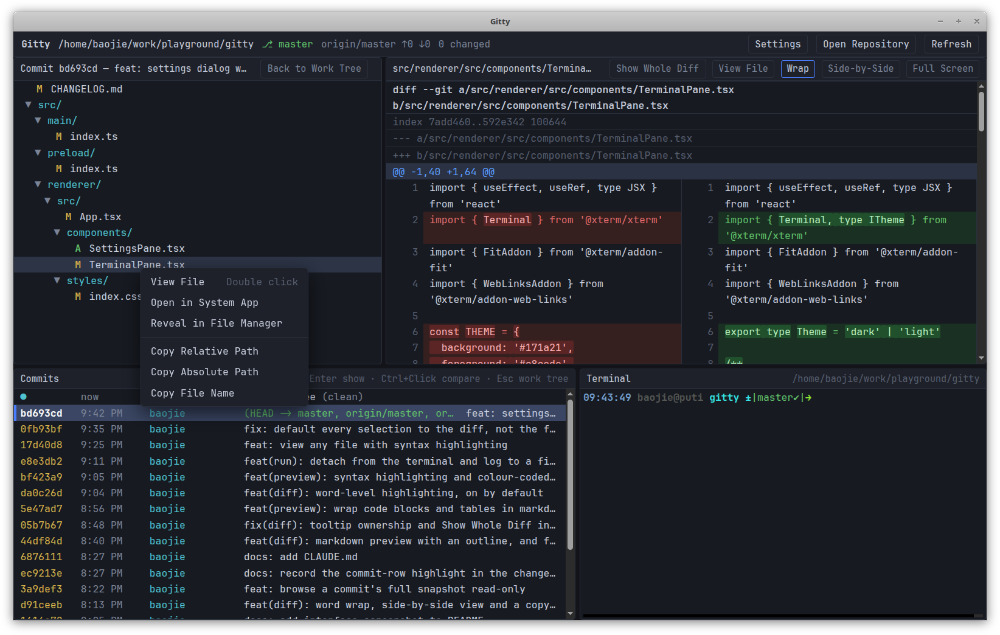

# Gitty

A four-pane git history browser for the desktop, in the spirit of `lazygit` but
with real mouse interaction: double-click to open a file, right-click to copy
its path, click two commits to diff them.

```
┌──────────────────────┬──────────────────────┐
│ Working Tree         │ Diff                 │
│ (or a commit's files)│ (unified, coloured)  │
├──────────────────────┼──────────────────────┤
│ Commits              │ Terminal             │
│ (log, ↑↓, Enter)     │ (a real shell)       │
└──────────────────────┴──────────────────────┘
```

All panes are resizable by dragging the separators.



## Why another one?

Because every tool I reached for got one thing wrong:

- **IDEs** — too heavy and too slow. (Believe me, I have tried every one I could
  find.)
- **lazygit, grv** — excellent tools, but unfriendly to the mouse and to
  selecting text.
- **gitui** — I want the commit list and the diff on screen at the same time.
- **SmartGit, GitKraken** — Java, heavy, dated, and they want your money.
- **gitg** and friends — again, no commit list and diff side by side.
- **tig** — diffs only, no file tree to browse.
- **gitk** — ugly!

Two more things I wanted and almost nothing offered: a **markdown preview**, and
**copy and paste that just works** anywhere in the window.

## Requirements

- Node.js 20 or newer
- `git` on `PATH`
- Linux, macOS or Windows with a desktop session

## Running

Install the `gitty` command once:

```bash
./setup.sh               # symlink into ~/.local/bin (no sudo)
./setup.sh --system      # symlink into /usr/local/bin (needs sudo)
```

`setup.sh` also installs a desktop launcher: the icon is added to the hicolor
theme and a `gitty.desktop` entry appears in the application menu (and on the
desktop, when the session has one). The icon cache and desktop database are
refreshed afterwards, so the entry shows up with its icon straight away.

Then open a repository from anywhere:

```bash
gitty                    # open the repository in the current directory
gitty /path/to/repo      # open another repository
gitty --fg               # keep it attached to the terminal (Ctrl+C quits)
gitty --dev              # hot-reloading development mode
gitty --any              # start even outside a work tree (what the desktop
                         # entry uses), falling back to the last repositories
```

Gitty detaches from the terminal and prints its pid, so the shell stays usable
and closing it does not take the window down. Output goes to
`${XDG_STATE_HOME:-~/.local/state}/gitty/gitty.log`, which is trimmed to its
last megabyte once it passes 4 MB.

`./run.sh` is the same script and works identically without the symlink. The
launcher installs dependencies and rebuilds the bundle when sources changed, so
the first run may take a moment. `npm run dev`, `npm run build` and `npm start`
are available directly as well.

### Linux: sandbox

On Linux the app runs with Chromium's SUID sandbox disabled
(`ELECTRON_DISABLE_SANDBOX=1`). The usual fix — making `chrome-sandbox` owned by
root with mode 4755 — cannot survive inside `node_modules`, so disabling it is
the pragmatic choice for a local tool that only reads your own repositories.

## Multiple repositories

A tab bar along the bottom holds every open repository — its basename, a dot
when the working tree has uncommitted changes, and a **×** to close it. **+**
(and **Ctrl+O**) opens another repository into a new tab; the title bar always
shows the active one. Each tab keeps its own panes and terminal, so a commit you
are reading and a shell you left running stay exactly where they were when you
switch away and back. Closing the last tab leaves an empty window with a button
to open the next repository. (Open tabs are not remembered across restarts.)

## Recent repositories

The repository name in the title bar is a menu of the repositories opened
before — basename plus its parent directory — most recent first.

- **Click** — open it in a new tab.
- **Ctrl/Cmd+click** or **middle-click** — open it in the current tab, replacing
  the repository there and keeping the tab's place in the bar.
- **Right-click** — remove the entry from the list. The menu stays open, so
  several can be cleared in a row.

**Open Repository…** and **Clear Recent** sit below. The list lives in
`~/.config/Gitty/recent-repos.json`, holds twelve entries, and skips any that
have since been moved or deleted.

Starting Gitty from a directory that is not inside a work tree falls back to the
last repository opened, instead of just complaining.

## The panes

### Working Tree (top left)

Changed files as a collapsible tree. Two status columns are shown: the staged
state (green) and the work-tree state (yellow / red); untracked files are `??`.

- **Click** — show the file's diff on the right.
- **Double-click** — view the whole file on the right, with line numbers and
  syntax highlighting (a rendered document for markdown).
- **Right-click** — View File, Open in System App, Reveal in File Manager, Copy
  Relative Path, Copy Absolute Path, Copy File Name.
- **Click a folder** — collapse or expand it.

When a commit or a commit range is selected, this pane lists that commit's files
instead; **Back to Work Tree** (or <kbd>Esc</kbd>) returns to the working tree.

### Diff (top right)

Unified diff with old/new line numbers, hunk headers and add/delete colouring.

- **Wrap** — wrap long lines instead of scrolling sideways. On by default.
- **Inline / Side-by-Side** — one column with `+`/`-` markers, or old and new
  next to each other, where a run of deletions is zipped with the additions that
  follow it. Wrapped halves stay aligned.
- **Full Screen** — the pane fills the window; <kbd>Esc</kbd>, the **Restore**
  button or a double-click on the header brings the four panes back. The
  terminal below keeps running while it is covered.
- **View File** — show the file's whole contents instead of its diff, with line
  numbers and syntax highlighting: from disk in the work tree, at the selected
  revision elsewhere. Markdown files get **Preview** instead (see below). This
  lasts until you select another file or commit — the default is always the
  diff. Snapshots are the exception and always view files, having no diff.
- **Right-click** — Copy Selection, Copy Whole Diff, and the same toggles.

Settings are remembered between runs. Rows render in chunks of 1500 and extend
as you scroll, so large commits stay responsive; diffs above 2 MB are truncated
with a notice.

#### Markdown preview

Selecting a `.md` file adds a **Preview** button — off by default, so a diff
stays a diff until you ask for the rendered document. It renders the file as a
whole: the version on disk in the work tree, the version at the selected commit
everywhere else.

Fenced code blocks are syntax-highlighted when they name a language, YAML front
matter is lifted out and shown as its own highlighted block, and heading levels,
list markers, links and inline code are colour-coded so structure reads at a
glance.

- **Wrap** — the same toggle as the diff, on by default. Prose always wraps; in
  a preview this decides whether fenced code blocks, wide tables and long inline
  strings wrap too, rather than scrolling sideways.
- **Outline** — the heading structure beside the document, indented by level,
  tracking the heading you have scrolled to. Click an entry to jump.
- **Right-click** — Copy Selection, Copy Markdown Source, the wrap and outline
  toggles, and Show Diff Instead.

Raw HTML inside the markdown is not rendered, and links open in the system
browser rather than inside the app.

### Commits (bottom left)

The log of the current branch, loaded 300 at a time and extended as you scroll.
The first row is the **Working Tree** — the uncommitted changes, with a count of
changed files; selecting it brings the top panes back to the work tree.

The branch in the title bar opens a menu of every local and remote-tracking
branch, newest commit first, and picking one shows that branch's history
instead. It is a read-only look: gitty runs no `checkout`, so the work tree,
its diffs and the terminals stay exactly where git left them. While you are
looking at another branch the title bar reads `⎇ main › other-branch` and the
commit pane says which branch it is listing; **Back to <branch>** returns.
Each tab browses on its own.

- **Click** or <kbd>Enter</kbd> — show that commit: its files fill the top-left
  pane and its full diff the top-right one.
- **Ctrl+Click** (<kbd>Cmd</kbd> on macOS), <kbd>Shift+Click</kbd> or
  <kbd>Space</kbd> — pick a second commit and diff the two, oldest first.
- **↑ ↓ / j k / PgUp / PgDn / Home / End** — move the cursor.
- **Right-click** — show the diff, copy the hash, the short hash or the subject,
  or diff against the currently selected commit.
- Selecting a file in the top-left pane narrows the diff to that file;
  **Show Whole Diff** widens it again.

### Terminal (bottom right)

A real interactive login shell (`$SHELL`) rooted at the repository, so any git
command can be run directly. The other panes refresh automatically when the
repository changes on disk.

The pane splits into as many shells as you want: **Split →** puts a new one
beside the focused terminal, **Split ↓** below it, and the separators between
them drag like every other pane. Clicking a terminal focuses it — the outlined
one is where the next split or **Close** lands. Splitting the same way twice
extends the row or column rather than nesting, so three side-by-side terminals
resize against each other.

**Close** ends the focused shell; leaving a shell with `exit` closes its split
by itself. The last terminal always stays: exiting it leaves the notice on
screen instead of an empty pane.

## Keyboard shortcuts

| Key | Action |
| --- | --- |
| <kbd>Enter</kbd> | Show the selected commit |
| <kbd>Space</kbd> / <kbd>Ctrl+Click</kbd> | Mark a second commit and diff the pair |
| <kbd>Esc</kbd> | Back to the working tree |
| <kbd>F5</kbd> / <kbd>Ctrl+R</kbd> | Refresh status and log |
| <kbd>Ctrl+O</kbd> | Open another repository in a new tab |
| <kbd>Ctrl+,</kbd> | Settings |

## Architecture

```
src/main       Electron main process — git commands, ptys, fs watchers,
               the recent-repository store, IPC
src/preload    contextBridge API exposed to the renderer as window.gitty
src/renderer   React UI — App.tsx manages tabs, RepoTab.tsx owns one
               repository's four panes
src/shared     Types shared by both sides
build          Application icon (SVG source and rendered PNG)
```

Git is driven through `execFile('git', …)` with `--porcelain=v2 -z` /
`--name-status -z` parsing, so paths with spaces and renames survive. No git
library is bundled; whatever `git` is on `PATH` is what you see. The renderer
runs with `contextIsolation` and no node integration.

## Licence

MIT
