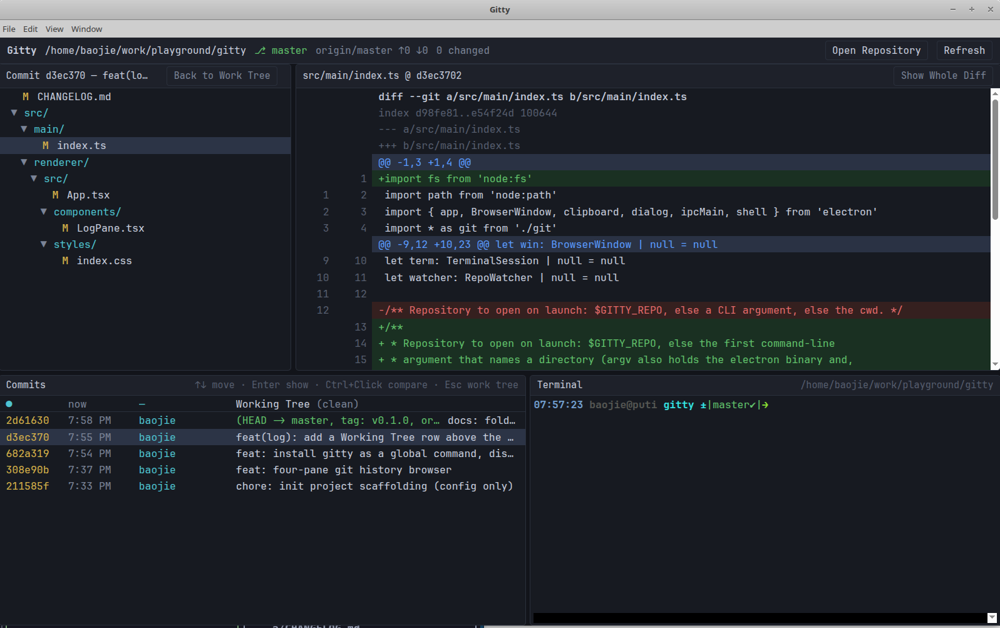

# Gitty

A four-pane git history browser for the desktop, in the spirit of `lazygit` but
with real mouse interaction: double-click to open a file, right-click to copy
its path, click two commits to diff them.

```
┌──────────────────────┬──────────────────────┐
│ Working Tree         │ Diff                 │
│ (or a commit's files)│ (unified, coloured)  │
├──────────────────────┼──────────────────────┤
│ Commits              │ Terminal             │
│ (log, ↑↓, Enter)     │ (a real shell)       │
└──────────────────────┴──────────────────────┘
```

All panes are resizable by dragging the separators.



## Requirements

- Node.js 20 or newer
- `git` on `PATH`
- Linux, macOS or Windows with a desktop session

## Running

Install the `gitty` command once:

```bash
./setup.sh               # symlink into ~/.local/bin (no sudo)
./setup.sh --system      # symlink into /usr/local/bin (needs sudo)
```

Then open a repository from anywhere:

```bash
gitty                    # open the repository in the current directory
gitty /path/to/repo      # open another repository
gitty --dev              # hot-reloading development mode
```

`./run.sh` is the same script and works identically without the symlink. The
launcher installs dependencies and rebuilds the bundle when sources changed, so
the first run may take a moment. `npm run dev`, `npm run build` and `npm start`
are available directly as well.

### Linux: sandbox

On Linux the app runs with Chromium's SUID sandbox disabled
(`ELECTRON_DISABLE_SANDBOX=1`). The usual fix — making `chrome-sandbox` owned by
root with mode 4755 — cannot survive inside `node_modules`, so disabling it is
the pragmatic choice for a local tool that only reads your own repositories.

## The panes

### Working Tree (top left)

Changed files as a collapsible tree. Two status columns are shown: the staged
state (green) and the work-tree state (yellow / red); untracked files are `??`.

- **Click** — show the file's diff on the right.
- **Double-click** — open the file with the system default application.
- **Right-click** — Open File, Reveal in File Manager, Copy Relative Path, Copy
  Absolute Path, Copy File Name.
- **Click a folder** — collapse or expand it.

When a commit or a commit range is selected, this pane lists that commit's files
instead; **Back to Work Tree** (or <kbd>Esc</kbd>) returns to the working tree.

### Diff (top right)

Unified diff with old/new line numbers, hunk headers and add/delete colouring.

- **Wrap** — wrap long lines instead of scrolling sideways. On by default.
- **Inline / Side-by-Side** — one column with `+`/`-` markers, or old and new
  next to each other, where a run of deletions is zipped with the additions that
  follow it. Wrapped halves stay aligned.
- **Right-click** — Copy Selection, Copy Whole Diff, and the same two toggles.

Both settings are remembered between runs. Rows render in chunks of 1500 and
extend as you scroll, so large commits stay responsive; diffs above 2 MB are
truncated with a notice.

### Commits (bottom left)

The log of the current branch, loaded 300 at a time and extended as you scroll.
The first row is the **Working Tree** — the uncommitted changes, with a count of
changed files; selecting it brings the top panes back to the work tree.

- **Click** or <kbd>Enter</kbd> — show that commit: its files fill the top-left
  pane and its full diff the top-right one.
- **Ctrl+Click** (<kbd>Cmd</kbd> on macOS), <kbd>Shift+Click</kbd> or
  <kbd>Space</kbd> — pick a second commit and diff the two, oldest first.
- **↑ ↓ / j k / PgUp / PgDn / Home / End** — move the cursor.
- **Right-click** — show the diff, copy the hash, the short hash or the subject,
  or diff against the currently selected commit.
- Selecting a file in the top-left pane narrows the diff to that file;
  **Show Whole Diff** widens it again.

### Terminal (bottom right)

A real interactive login shell (`$SHELL`) rooted at the repository, so any git
command can be run directly. The other panes refresh automatically when the
repository changes on disk.

## Keyboard shortcuts

| Key | Action |
| --- | --- |
| <kbd>Enter</kbd> | Show the selected commit |
| <kbd>Space</kbd> / <kbd>Ctrl+Click</kbd> | Mark a second commit and diff the pair |
| <kbd>Esc</kbd> | Back to the working tree |
| <kbd>F5</kbd> / <kbd>Ctrl+R</kbd> | Refresh status and log |
| <kbd>Ctrl+O</kbd> | Open another repository |

## Architecture

```
src/main       Electron main process — git commands, pty, fs watcher, IPC
src/preload    contextBridge API exposed to the renderer as window.gitty
src/renderer   React UI — the four panes
src/shared     Types shared by both sides
```

Git is driven through `execFile('git', …)` with `--porcelain=v2 -z` /
`--name-status -z` parsing, so paths with spaces and renames survive. No git
library is bundled; whatever `git` is on `PATH` is what you see. The renderer
runs with `contextIsolation` and no node integration.

## Licence

MIT
