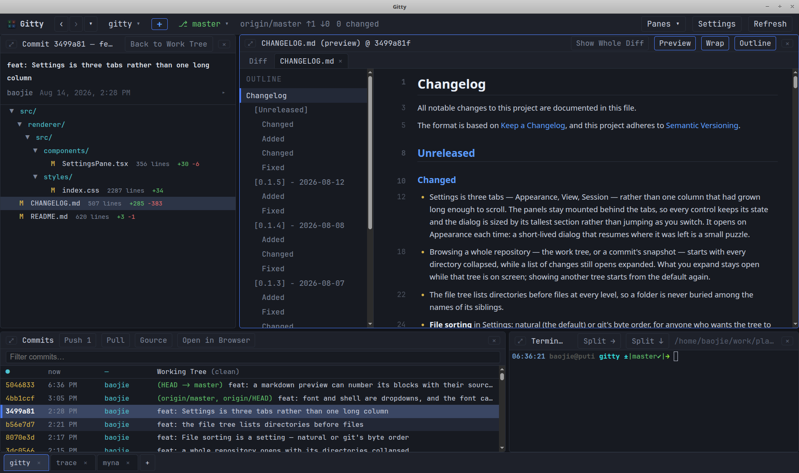

# Gitty

**English** · [简体中文](ref/readme/README.zh-CN.md) · [日本語](ref/readme/README.ja.md) · [한국어](ref/readme/README.ko.md) · [Français](ref/readme/README.fr.md) · [Deutsch](ref/readme/README.de.md) · [Español](ref/readme/README.es.md) · [Русский](ref/readme/README.ru.md) · [Português](ref/readme/README.pt.md)

*This English README is the official version and the only one kept up to date.
The translations are snapshots, each stamped with the date it was made; where
one disagrees with this file, this file is right.*

A four-pane git history browser for the desktop, in the spirit of `lazygit` but
with real mouse interaction: double-click to open a file, right-click to copy
its path, click two commits to diff them.

```
┌──────────────────────┬──────────────────────┐
│ Working Tree         │ Diff                 │
│ (or a commit's files)│ (unified, coloured)  │
├──────────────────────┼──────────────────────┤
│ Commits              │ Terminal             │
│ (log, ↑↓, Enter)     │ (a real shell)       │
└──────────────────────┴──────────────────────┘
```

All panes are resizable by dragging the separators, and each one hides and comes
back — see [Full screen and hiding](#full-screen-and-hiding).

Things the other git browsers mostly do not do:

- **A real shell docked to the history.** Not a git-calling widget — a genuine
  login shell (`$SHELL`) rooted at the repository, in the same window as the
  diff, splittable into several. Most git browsers either have no terminal or
  launch an external one, so checking a hunch means alt-tabbing. Here it is
  right there, and every other pane refreshes as the repository changes.
- **Documents, not only diffs.** Markdown is rendered, HTML is shown in a
  sandboxed frame, images are shown as pictures — all at the revision you are
  on. A README from two years ago renders with the screenshots *that* commit
  shipped, read straight out of the object database — nothing on disk is
  involved, and nothing is fetched from the web, because reading someone else's
  README should not announce you to whatever host it points at.
- **Rendered markdown that can still tell you where you are in the file.** Turn
  on **Markdown source lines** and every heading, paragraph, list item, table,
  fenced block and image is numbered in the gutter with the line it starts on in
  the source — so a passage you found by reading can be edited by line.
- **A diff, a blame, a file's history and a rendered README, open at once.**
  Files open as their own tabs *beside* the diff rather than over it, each
  remembering the revision it was opened at. Reading a file never costs you the
  change you were looking at.
- **<kbd>Ctrl+F</kbd> that works in whatever the pane is showing** — including
  rendered markdown, where a phrase is found across bold and code spans because
  the search reads the rendered text, and inside the HTML preview's frame.
- **The history, served to your browser.** **Open in Browser** hands a commit —
  its metadata, its files, its diffs — to the system browser, from a web server
  inside the app on `127.0.0.1` whose URLs carry a token minted for this
  session. Commits are real URLs, so the history can be read in tabs, kept
  open, and searched with the browser's own find, for as long as the app is
  running.
- **[gource](https://gource.io/) in one click**, when it is installed: the
  repository's whole history as an animation, in its own window. Where gource is
  absent the button is not drawn — nothing is downloaded or offered that cannot
  run.
- **Nine interface languages and an explicit time zone.** Git records every
  commit with its author's offset, so a stamp is always a choice of zone; here
  you make it, and the whole UI — log, blame, file history, the boundary between
  "today" and a date — follows.



## Why another one?

Because every tool I reached for got one thing wrong:

- **IDEs** — too heavy and too slow. (Believe me, I have tried every one I could
  find.)
- **lazygit, grv** — excellent tools, but unfriendly to the mouse and to
  selecting text.
- **gitui** — I want the commit list and the diff on screen at the same time.
- **SmartGit, GitKraken** — Java, heavy, dated, and they want your money.
- **gitg** and friends — again, no commit list and diff side by side.
- **tig** — diffs only, no file tree to browse.
- **gitk** — ugly!

Two more things I wanted and almost nothing offered: a **markdown preview**, and
**copy and paste that just works** anywhere in the window.

## Requirements

- `git` on `PATH`
- Linux, macOS or Windows with a desktop session
- Node.js 20 or newer — only for the npm and source installs below; the `.deb`
  brings its own runtime
- Optionally [gource](https://gource.io/) on `PATH`, for
  [the animation](#gource); nothing changes if it is absent

## Running

### Download a package (Linux)

The `.deb` on the [releases page](https://github.com/baojie/gitty/releases) is
the shortest way in — no Node, no build:

```bash
sudo dpkg -i gitty-desktop_*_amd64.deb
```

It installs `/usr/bin/gitty`, an application-menu entry with its icon, and runs
with Chromium's sandbox **on** — see
[Linux desktop integration](#linux-desktop-integration). An `.AppImage` is
published beside it for distributions without dpkg; it is the second choice,
because an AppImage cannot install the sandbox helper.

### From npm

```bash
npm install -g gitty-desktop      # installs the gitty command globally
```

### From a checkout

Link it into your PATH with:

```bash
./setup.sh               # symlink into ~/.local/bin (no sudo)
./setup.sh --system      # symlink into /usr/local/bin (needs sudo)
```

The `setup.sh` route also installs a clickable launcher, picked by platform.

On **Linux** the icon is added to the hicolor theme and a `gitty.desktop` entry
appears in the application menu (and on the desktop, when the session has one).
The icon cache and desktop database are refreshed afterwards, so the entry shows
up with its icon straight away. It carries one workaround, and the app runs with
one sandbox flag off — see
[Linux desktop integration](#linux-desktop-integration).

On **macOS** a minimal `Gitty.app` is written to `~/Applications` (with a
symlink on the Desktop) wrapping the same `run.sh`. Nothing is packaged: the
bundle exists to give Finder and the Dock a name and an icon. The Dock is not
touched — drag it there yourself if you want it pinned. See
[macOS app bundle](#macos-app-bundle).

Then open a repository from anywhere:

```bash
gitty                    # open the repository in the current directory
gitty /path/to/repo      # open another repository
gitty --fg               # keep it attached to the terminal (Ctrl+C quits)
gitty --dev              # hot-reloading development mode
gitty --any              # start even outside a work tree (what the desktop
                         # entry uses), falling back to the last repositories
```

Gitty detaches from the terminal and prints its pid, so the shell stays usable
and closing it does not take the window down. Output goes to
`${XDG_STATE_HOME:-~/.local/state}/gitty/gitty.log`, which is trimmed to its
last megabyte once it passes 4 MB.

`./run.sh` is the same script and works identically without the symlink. The
launcher installs dependencies and rebuilds the bundle when sources changed, so
the first run may take a moment. `npm run dev`, `npm run build` and `npm start`
are available directly as well.

Starting Gitty from a directory that is not inside a work tree falls back to the
last repository opened, instead of just complaining.

## The window

Four panes in the middle, a title bar above them and a tab bar below.

### Title bar

Left to right, it describes the active repository and then acts on it:

- **Gitty** — the icon and name at the far left open the **About** dialog: the
  version, build time, author, and the Electron, Chromium and Node versions,
  with a link to the home page.
- **‹ › ▾** — where you have been in this repository. See
  [Going back](#going-back).
- **The repository path** is a button: it opens the
  [recent repositories](#recent-repositories) menu.
- **+** beside it — a directory picker, opening the repository you choose into a
  new tab (<kbd>Ctrl+O</kbd>). It sits with the repository button because the
  two are the same subject: which repository you are looking at, and opening
  another.
- **⎇ branch** is a button too — the branch git has checked out, and a menu of
  every other branch to read. See
  [browsing another branch](#browsing-another-branch).
- **`origin/main ↑2 ↓0`** — the upstream of the checked-out branch and how far
  ahead and behind it is. Absent on a branch that tracks nothing.
- **`3 changed`** — how many files the work tree has uncommitted, the same count
  the **Working Tree** row in the commits pane carries.
- **Panes ▾** — show or hide each of the four; see
  [Full screen and hiding](#full-screen-and-hiding).
- **Settings** — the preferences dialog ([Settings](#settings)),
  also <kbd>Ctrl+,</kbd>.
- **Refresh** — re-read status and log by hand (<kbd>F5</kbd> /
  <kbd>Ctrl+R</kbd>). Gitty watches the repository and refreshes on its own;
  this is for the times watching cannot see a change.

While you are reading another branch the branch button reads `⎇ main ›
other-branch`, and errors from the last git command appear in red beside the
counts.

### Going back

Reading history means wandering: a commit, a file inside it, another commit two
pages down the log, then back to the first one. The three buttons at the left of
the title bar remember that wandering, the way a browser does.

- **‹** (<kbd>Alt+←</kbd>) returns to the place you were looking at before this
  one, and **›** (<kbd>Alt+→</kbd>) goes back to the one you stepped away from.
  Both are greyed out when there is nowhere to go, and hovering either one names
  the place it would take you to.
- **▾** lists the places themselves, most recent first, with a dot on the one
  you are at. Pick any of them to jump straight there.

A *place* is everything the two top panes were showing: the view — the work
tree, one commit, a range of two, a snapshot — the file selected inside it, and
the document opened beside the diff. So a stop reads as `Working tree`,
`7bb7787 — Refresh screenshot batches`, `src/main/git.ts @ 7bb7787` or
`blame: src/main/git.ts @ 7bb7787`, and returning to it puts the same file back
on screen at the same revision rather than merely reselecting the commit.

The history belongs to the repository, not to the window: each tab remembers its
own fifty most recent places, and switching tabs switches which ones the buttons
walk. It is not kept across restarts.

### Tabs

A tab bar along the bottom holds every open repository — its basename, a yellow
dot when the working tree has uncommitted changes, and a **×** to close it. The
dot counts anything `git status` reports, untracked files included, and it earns
its place on the tabs you are *not* looking at: the active repository already
says `3 changed` in the title bar, while a background tab is hidden entirely, so
the dot is the only sign that there is work left there. Hovering a tab names the
repository and says so in words.

**+** (and <kbd>Ctrl+O</kbd>) opens another repository into a new tab; the title
bar always shows the active one. Each tab keeps its own panes and terminal, so a
commit you are reading and a shell you left running stay exactly where they were
when you switch away and back. Closing the last tab leaves an empty window with
a button to open the next repository. (Open tabs are not remembered across
restarts.)

### Recent repositories

The repository path in the title bar is a menu of the repositories opened
before — basename plus its parent directory — most recent first.

- **Click** — open it in a new tab.
- **Ctrl/Cmd+click** or **middle-click** — open it in the current tab, replacing
  the repository there and keeping the tab's place in the bar.
- **Right-click** — remove the entry from the list. The menu stays open, so
  several can be cleared in a row.

**Open Repository…** and **Clear Recent** sit below. The list lives in
`~/.config/Gitty/recent-repos.json`, holds twelve entries, and skips any that
have since been moved or deleted.

### Full screen and hiding

Every pane header carries the same two controls: **⤢** at its left fills the
window with that pane, and **×** at its right hides it.

Full screen covers everything else, including the title and tab bars, and the
panes underneath keep working — the terminal goes on running while it is
covered. **⤡** in the same corner, <kbd>Esc</kbd>, a double-click on the
header, or <kbd>Ctrl+Shift+1</kbd> … <kbd>Ctrl+Shift+4</kbd> restores the
layout. Only one pane is full screen at a time.

Hiding is the other direction — any pane can be put away and brought back:

- **Panes** in the title bar lists all four, with a dot beside the visible ones;
  clicking one toggles it, and **Show All Panes** restores the four-pane layout.
- <kbd>Ctrl+1</kbd> … <kbd>Ctrl+4</kbd> toggle Files, Diff, Commits and
  Terminal, in that order.
- <kbd>Ctrl+Shift+0</kbd> brings all four back — zero for "all of them", one
  key past the four that each toggle one. It takes the Shift because
  <kbd>Ctrl+0</kbd> is the browser engine's reset-zoom, which the View menu
  keeps.

Whatever is left shares out the window, so hiding the commits pane gives the
diff the full height. The last visible pane has no **×** — an empty window
would leave nothing to click. Hidden panes are remembered across restarts, and
the terminal pane is only put away, never closed: its shells keep running and
come back with their scrollback when it does.

## The panes

### Working Tree (top left)

Changed files as a collapsible tree, each with its line count beside the name.
Browsing a whole repository — the work tree or a commit's snapshot — opens with
every directory shut, since that is a tree to descend into rather than a list of
changes to read; a list of changes opens expanded. Directories come before files at every level, and within each group names are
sorted the way a
reader expects rather than the way a byte comparison does: the digits in a name count as a number, so `W9` comes before `W10`, and
case is not a first-order difference, so `butler/` sorts with the b's instead of
after every capital letter.
Two status columns are shown: the staged state (green) and the work-tree state
(yellow / red); untracked files are `??`. The count is read from disk in the
work tree and from the revision everywhere else; binary files, deleted files and
anything above 8 MB simply show none. After it comes the churn — how many lines
this change added and removed in that file, `+12 −3`, against HEAD in the work
tree and against the parent for a commit or a range. A snapshot is a tree rather
than a change, so it has no churn; nor do binary files or a merge commit, whose
combined diff attributes nothing.

- **Click** — show the file's diff on the right.
- **Double-click** — open the whole file as a document beside the diff, with
  line numbers and syntax highlighting (a rendered document for markdown, the
  picture itself for an image).
- **Click a status column** — stage the file, or unstage it if it is staged.
- **Right-click** — View File, Open in System App, Reveal in File Manager, Copy
  Relative Path, Copy Absolute Path, Copy File Name, Blame File, File History,
  Stage / Unstage File, Discard Changes, Delete File.
- **Click a folder** — collapse or expand it.

**Discard Changes** puts the file back to what the index holds, after a native
confirmation that says plainly there is no undo; an untracked file has no index
version to go back to, so it offers **Delete File** instead, which goes to the
system trash.

**Commit with agent** in the header hands the index over. It types a command of
your choosing — Settings ▸ Session ▸ Agent command — into the shell in the
bottom-right pane and presses Enter, and that is all it does: no model is
called from inside Gitty, nothing leaves the machine that you did not send. The
agent's prompts and output appear in the terminal, where there is a real tty,
so hooks and gpg signing work as they always do. There is no default that is
known to run anywhere, so an unset command says where to set it rather than
failing quietly. Right-clicking the work-tree row in the commit log also offers
**Copy Staged Diff**, for a conversation happening in another window.

When a commit or a commit range is selected, this pane lists that commit's files
instead; **Back to Work Tree** (or <kbd>Esc</kbd>) returns to the working tree.
In a [snapshot](#snapshots) it lists the entire tree at that commit, not just
what changed.

### Diff (top right)

Unified diff with old/new line numbers, hunk headers and add/delete colouring,
laid out as a list of files: each path is a full-width heading, the hunk header
is dimmed — a line range, not the thing to look at first — and a rename reads
`old → new`. With no file selected it shows everything at once: every
uncommitted change in the work tree, or every file in the selected commit.

- **Show Whole Diff** — back to that combined diff after picking a file. It
  stays in the header and lights up while the whole diff is what you are
  looking at. The work-tree version covers staged and unstaged changes together
  and inlines untracked files (up to 50, then a notice), which `git diff` alone
  leaves out.
- **Wrap** — wrap long lines instead of scrolling sideways. On by default.
- **Inline / Side-by-Side** — one column with `+`/`-` markers, or old and new
  next to each other, where a run of deletions is zipped with the additions that
  follow it. Wrapped halves stay aligned.
- **File headings** — each heading folds its file: the triangle collapses it
  to the name, and **Collapse All** / **Expand All** in the header does the
  lot. **Ctrl+click** a heading opens that file in a new document tab;
  right-click it for **Open in a New Tab**, **Select in the File List**, the
  path copies and — in the work tree, where the file on disk is the version
  shown — **Open in System App** and **Reveal in File Manager**. A rename
  opens its new path.
- **Stage / Unstage** — while the diff is one tracked file's work, every hunk
  header carries a button that puts that hunk into the index, or takes it back
  out. Select lines first and the button becomes **Stage 3 lines**: an
  unselected addition is left out of the patch, an unselected deletion is
  demoted to a context line, and the hunk header is recomputed — the same split
  `git add -p` makes, from a window where the whole file is in front of you.
  The selection is the ordinary text selection, so a drag still copies. A
  selection spanning two hunks gives each of them its own part of it.
- **Unstaged / Staged** — which side of the index a file is being read from,
  shown once both sides hold something. Staging acts on whichever is on screen.
  Binary files, mode changes and renames have no hunks to pick and are staged
  whole from the file list; hunk buttons also disappear while **Ignore
  whitespace** is on, because that diff does not hold every change it would
  apply.
- **Right-click** — Copy Selection, Copy Whole Diff, and the same toggles.

Changed words inside a changed line are highlighted where that reads better than
the whole line at once; it is **Word highlight** in [Settings](#settings).

Settings are remembered between runs. Rows render in chunks of 1500 and extend
as you scroll, so large commits stay responsive; diffs above 2 MB are truncated
with a notice.

### Viewing files

A diff is what the pane shows by default, but any file can be opened whole:
**double-click** it in the tree, use **View File** / **Preview** in the header,
**Ctrl+click** a file heading in the diff, or take it from either context menu.

The file opens as its own document in a strip of tabs beside the diff, rather
than over it, so a file can be read without losing the diff you were on. The
**Diff** tab is always first and a single click in the tree still browses diffs
in place. Each document remembers the revision it was opened at, closes with its
own **×**, and re-reads a work-tree file when the repository changes. Source
files get line numbers and syntax highlighting; markdown opens
[rendered](#markdown-preview), with a toggle back to the source; HTML opens
[rendered too](#html-preview); an image opens as [the picture](#images).

Which revision you get follows the pane: the file on disk in the work tree, the
file as it was at the selected commit everywhere else. Opening a document is an
action rather than a mode — selecting another file or another commit puts the
diff back — so the pane is never stuck showing files when you wanted changes.

#### Snapshots

Right-click a commit and choose **Browse Snapshot** to read the repository as it
was at that commit: the top-left pane lists the *entire* tree rather than the
files that commit touched, and picking any file opens it at that revision. A
snapshot has no diff to show, so every file there is a document.

The files in a snapshot never existed on disk at that revision, which is why
**Open in System App** hands over a temporary copy of it and **Reveal in File
Manager** is not offered. **Back to Work Tree** (or <kbd>Esc</kbd>) leaves.

#### Markdown preview

Selecting a `.md` file adds a **Preview** button — off by default, so a diff
stays a diff until you ask for the rendered document. It renders the file as a
whole: the version on disk in the work tree, the version at the selected commit
everywhere else.

Fenced code blocks are syntax-highlighted when they name a language, YAML front
matter is lifted out and shown as its own highlighted block, and heading levels,
list markers, links and inline code are colour-coded so structure reads at a
glance.

- **Wrap** — the same toggle as the diff, on by default. Prose always wraps; in
  a preview this decides whether fenced code blocks, wide tables and long inline
  strings wrap too, rather than scrolling sideways.
- **Outline** — the heading structure beside the document, indented by level,
  tracking the heading you have scrolled to. Click an entry to jump, and drag
  the separator between it and the document to give either side more room. The
  width is shared by every document in the repository — it is a reading
  preference, not a property of one file — and lasts as long as the window,
  like the other panes' sizes.
- **Source lines** — off by default, and turned on in
  [Settings](#settings): every heading, paragraph, list item, table, fenced
  block and image is numbered in the left gutter with the line it starts on in
  the source. The numbers are drawn rather than inserted, so they stay out of a
  selection you copy and out of what <kbd>Ctrl+F</kbd> searches. An image
  written inside a sentence takes its paragraph's line, having none of its own.
- **<kbd>Ctrl+F</kbd>** — find in the document; see
  [Finding text](#finding-text).
- **Right-click** — Copy Selection, Copy Markdown Source, the wrap and outline
  toggles, and Show Diff Instead.

Raw HTML inside the markdown is not rendered, and links open in the system
browser rather than inside the app. Images written relative to the document are
read out of the repository — at the same revision as the document, so an old
commit shows the screenshots it shipped with. One the repository does not have
there leaves a dashed placeholder with its alt text. Images from the web are not
fetched at all: reading a stranger's README should not announce you to whatever
host it points at.


#### HTML preview

An `.html`, `.htm` or `.xhtml` file gets the same **Preview** button, and the
document is rendered rather than shown as source — the version on disk in the
work tree, the version at the selected commit everywhere else.

It renders in a sandboxed frame loaded through `srcdoc`, so the page can never
navigate the app away from itself. Its own stylesheets apply — layout, colours,
fonts are the document's. Scripts do not run and remote images are not fetched:
the frame inherits the app's content security policy, which admits neither. A
page is shown, not executed. **Wrap** decides whether the frame scrolls on its
own or grows to its content so the whole page scrolls as one. <kbd>Ctrl+F</kbd>
and <kbd>Ctrl+Shift+C</kbd> work inside the frame, whose keys never reach the
rest of the window.

#### Images

A `.png`, `.jpg`, `.gif`, `.webp`, `.bmp`, `.ico`, `.avif` or `.svg` opens as
the picture rather than as a report that it is binary — from disk in the work
tree, from the commit everywhere else. It is fitted to the pane over a
checkerboard, so transparency reads as transparency; **click** it for actual
size and scroll around, click again to fit. Its pixel dimensions and size on
disk sit underneath. Images above 12 MB are not inlined.


#### Blame and file history

Right-click any file in the tree and choose **Blame File** or **File History**;
both open as documents beside the diff. Blame shows one row per source line —
the commit, its author, its date and the line itself, highlighted like the code
viewer, with an em dash where a line is not committed yet — at the revision you
are viewing. File History lists every commit
that touched the file, follows renames, and clicking a commit opens it.

Right-clicking a blame row offers **History of These Lines**: `git log -L` over
the lines the selection covers — or the clicked line, with no selection — which
opens as its own document showing each commit that touched them together with
what it did to them. Blame answers *who last*; this answers *how it got this
way*. It tracks the range across renames by itself.

#### Searching the repository

**Search** in the working-tree pane's header opens a box above the file list
and runs `git grep`. The results are a document grouped by file, line numbers
down the left; clicking one opens that file at that line, with the line marked.

The search follows the revision on screen: in the work tree it reads what is on
disk, uncommitted work and all, and in a commit or a snapshot it reads that
revision — the box says which. Above 2000 hits it stops and says so, the way an
oversized diff does. The pattern reaches git as a single argument, so a regular
expression is not eaten on the way.

### Commits (bottom left)

The log of the current branch, loaded 300 at a time and extended as you scroll.
The first row is the **Working Tree** — the uncommitted changes, with a count of
changed files; selecting it brings the top panes back to the work tree. A filter
box above the log narrows the list — debounced, with a ✕ to clear — and the
result pages the same way.

The dropdown beside it says what is being searched:

| | |
| --- | --- |
| **Message / Author** | The commit message and the author, case-insensitively. The default. |
| **Content** | git's `-S`: the commits where the *number of occurrences* of the text changed — where it was introduced or removed. Literal, so a search full of `.` and `(` means those characters. |
| **Content regex** | git's `-G`: every commit whose diff matches the expression, including the ones that only moved the line about. |

The two content modes answer the question blame cannot — *which commit
introduced this line* — and they read every diff in the history to do it, so
the box says it is searching while they run. Changing the text or the mode
kills the search still running; nothing is spliced into a command line, so a
regular expression reaches git as one argument.

- **Click** or <kbd>Enter</kbd> — show that commit: its files fill the top-left
  pane and its full diff the top-right one. The commit's subject, author, date
  and full body appear in a strip above the file list; when the body is long, a
  ▸ toggle folds it away so the file list keeps the room.
- **Ctrl+Click** (<kbd>Cmd</kbd> on macOS), <kbd>Shift+Click</kbd> or
  <kbd>Space</kbd> — pick a second commit and diff the two, oldest first.
- **↑ ↓ / j k / PgUp / PgDn / Home / End** — move the cursor.
- **Right-click** — show the diff, copy the hash, the short hash or the subject,
  [browse the snapshot](#snapshots), or diff against the currently selected
  commit.
- **Right-click → Open in Browser** — render this commit in the system browser;
  **Copy Commit URL** copies the link. A web server inside the app serves every
  open repository as a browsable commit list — the commits pane's **Open in
  Browser** button lands there — with each commit's metadata, files and diff,
  and per-file diffs one click away.

  It listens on `127.0.0.1`, and that alone would not be much: loopback keeps
  other machines out, not other pages in your own browser, any of which could
  fetch it. So every URL carries a token generated at startup and kept in
  memory — `/t/<token>/…` — which the links Gitty hands you already have. A
  wrong token is a 404 rather than a 403, a request whose `Host` is not
  loopback is refused (that is what makes DNS rebinding pointless), and the
  pages are served `Referrer-Policy: no-referrer`, so following a link out of
  a commit message does not take the token with it. The token is new each
  launch, so the URLs work while this session is running.
- Selecting a file in the top-left pane narrows the diff to that file;
  **Show Whole Diff** widens it back out.


#### Gource

If [gource](https://gource.io/) is on `PATH`, the commits pane grows a
**Gource** button beside **Open in Browser**: it plays the repository's history
as an animation — the directory tree growing, files lighting up as each commit
lands, one author flying between them per name in the log. Gource opens a window
of its own and keeps running after you close Gitty; the button only waits long
enough to see that it started, and shows what gource said if it did not.

It is started with a day of history per half second, idle files kept on screen
and long gaps skipped, which is what makes a real repository readable rather
than a slow trickle. Nothing is installed for you: where gource is not on
`PATH`, the button is simply not there.

#### Browsing another branch

The branch in the title bar opens a menu of every local and remote-tracking
branch, newest commit first, and picking one shows that branch's history
instead. It is a read-only look: gitty runs no `checkout`, so the work tree,
its diffs and the terminals stay exactly where git left them. While you are
looking at another branch the title bar reads `⎇ main › other-branch` and the
commit pane says which branch it is listing; **Back to <branch>** returns.
Each tab browses on its own.

#### Push and Pull

**Push** and **Pull** sit in the header, and both act on the checked-out branch
whichever branch the log is pointed at. **Push** counts what is unpushed —
**Push 3** — and greys out when there is nothing to send; on a branch that
tracks nothing it publishes the branch to `origin` and sets the upstream.
**Pull** fast-forwards from the upstream, and is greyed out when there is no
upstream to pull from. Whatever git says appears above the log — click to
dismiss it; failures stay until you do.

Neither can answer a prompt: there is no terminal behind them, so a push that
wants a password or a passphrase fails with git's own message rather than
hanging, and a pull that cannot fast-forward says so. Both are then finished by
hand in the terminal pane, which is right there.

### Terminal (bottom right)

A real interactive login shell (`$SHELL`) rooted at the repository, so any git
command can be run directly. <kbd>Ctrl+Shift+C</kbd> copies the terminal's
selection — <kbd>Ctrl+C</kbd> there is the interrupt, and stays the interrupt.
The same chord copies in every other pane too, so it does not change meaning as
the focus moves. The other panes refresh automatically when the
repository changes on disk. Which shell it starts, and whether it starts as a
login shell, are [Settings](#settings); both are read when a terminal is
created, so a change takes effect on the next split.

The pane splits into as many shells as you want: **Split →** puts a new one
beside the focused terminal, **Split ↓** below it, and the separators between
them drag like every other pane. Clicking a terminal focuses it — the outlined
one is where the next split or **Close** lands. Splitting the same way twice
extends the row or column rather than nesting, so three side-by-side terminals
resize against each other.

**Close** ends the focused shell; leaving a shell with `exit` closes its split
by itself. The last terminal always stays: exiting it leaves the notice on
screen instead of an empty pane.

## Finding text

<kbd>Ctrl+F</kbd> searches whatever the right-hand pane is showing: a diff, a
file, a rendered markdown document, an [HTML preview](#html-preview), a blame,
or a file's history. Every match is highlighted with the current one picked out,
<kbd>Enter</kbd> and <kbd>Shift+Enter</kbd> (or the arrows) walk them and wrap
around at either end, the count says where you are, and <kbd>Esc</kbd> closes.

The search is case-insensitive and reads the text as rendered, not the markup
behind it — so a phrase is found across the bold and code spans markdown leaves
inside it, and a diff is searched as the lines you see. Views that render in
chunks as you scroll (a long file, a large diff) render the rest when the strip
opens, so the count covers the whole thing rather than the part scrolled to so
far. A collapsed file in a multi-file diff stays collapsed and is not searched.

## Settings

**Settings** in the title bar, or <kbd>Ctrl+,</kbd>. Everything here applies to
every tab and is remembered across restarts; **Restore Defaults** puts it all
back. The dialog is in three tabs — **Appearance**, **View** and **Session** —
so it stays one screenful as it grows; the table below lists them in that
order.

| | |
| --- | --- |
| **Theme** | Dark or Light. |
| **Language** | English, 简体中文, 日本語, 한국어, Français, Deutsch, Español, Русский or Português — the interface, the menus and the dialogs all change together without restarting. |
| **Time zone** | The zone every date and time on screen is rendered in: the machine's own by default, or UTC, or any zone the system knows. Git records each commit with its author's offset, so a stamp is always a choice of zone — this is where it is made. The log's date column follows it, which means the boundary between "today" and a date moves with it too. |
| **Time format** | Absolute (a clock time or a date) or Relative (`28m ago`, `2h ago`). Relative sidesteps the zone question entirely; the hover tip on a row stays absolute either way, and names its zone. |
| **Font size** | 9 – 20, in half points. Applies to every pane, the terminal included. |
| **Monospace font** | The family the panes and the terminal are drawn in, chosen from the monospace fonts found on this machine. **System default** is the built-in stack (JetBrains Mono, Fira Code, DejaVu Sans Mono, …). |
| **Row height** | 18 – 26 pixels — the line height every list is built on, the file tree, the log and the diff. Tighter fits more on screen, looser reads easier. |
| **Diff layout** | Inline or Side-by-Side, the same toggle the diff header carries. |
| **Context lines** | 0 – 25 unchanged lines around each hunk — git's `-U`, whose own default is 3. Widen it to see what a change sits in, narrow it to fit more of a large diff on screen. |
| **Ignore whitespace** | Off, Amount (git's `-b`: a run of spaces changing length is not a change) or All (`-w`: no whitespace difference is). Reindented or rewrapped code reads as unchanged rather than as a wall of red and green. The file list's `+12 −3` counts follow the same setting, so it cannot claim lines the diff then refuses to show. |
| **Word wrap** | Wrap long lines instead of scrolling sideways. |
| **Word highlight** | Mark the words that changed inside a changed line, not just the line. |
| **Markdown outline** | Show the outline beside a rendered document. |
| **Markdown source lines** | Number each block of a rendered document with the line it starts on in the source. Headings, paragraphs, list items, tables, fenced code and images all carry one, in a gutter down the left. Off by default. |
| **File sorting** | Natural or Byte order. Natural reads the digits in a name as a number (`W9` before `W10`) and puts case second; byte order is git's own, where every capital sorts ahead of every lowercase letter. |
| **Reopen last session** | Reopen the repositories that were open when the app last exited. The repository Gitty was started with is still the active tab; ones that have since been deleted are quietly dropped. |
| **Shell** | The shell a terminal starts, listed from `/etc/shells` plus the usual paths (`COMSPEC` and PowerShell on Windows). **System default** is `$SHELL`. A path that has since gone falls back to it rather than leaving a dead pane. |
| **Login shell** | Start it with `-l`, so the user's profile is sourced. Turn it off for a faster, quieter shell — no profile output, no login-time checks. Windows shells have no such flag and ignore this. |
| **Agent command** | What **Commit with agent** types into the focused shell. The default is a placeholder, not a command known to work here: which agent is installed is not something Gitty can know, so an unset or wrong command fails in the terminal where you can see it, rather than inside the app where you cannot. |

**Shell** and **Login shell** are read when a terminal is created, so they take
effect on the next split or the next repository tab, not in the shells already
running. **Word wrap**, **Diff layout** and **Markdown outline** are the same toggles the
diff header carries, so changing one in either place changes both. **Word
highlight** lives here only.

## Keyboard shortcuts

| Key | Action |
| --- | --- |
| <kbd>Enter</kbd> | Show the selected commit |
| <kbd>Space</kbd> / <kbd>Ctrl+Click</kbd> | Mark a second commit and diff the pair |
| <kbd>Ctrl+Click</kbd> on a file heading | Open that file in a new document tab |
| <kbd>Ctrl+F</kbd> | Find in the diff, the file, or whatever the pane is showing |
| <kbd>Ctrl+C</kbd> / <kbd>Ctrl+Shift+C</kbd> | Copy the selection, anywhere in the window |
| <kbd>Esc</kbd> | Back to the working tree |
| <kbd>Alt+←</kbd> / <kbd>Alt+→</kbd> | Back and forward through the places viewed |
| <kbd>F5</kbd> / <kbd>Ctrl+R</kbd> | Refresh status and log |
| <kbd>Ctrl+O</kbd> | Open another repository in a new tab |
| <kbd>Ctrl+,</kbd> | Settings |
| <kbd>Ctrl+1</kbd> … <kbd>Ctrl+4</kbd> | Hide or show Files, Diff, Commits, Terminal |
| <kbd>Ctrl+Shift+0</kbd> | Show all four panes again |
| <kbd>Ctrl+Shift+1</kbd> … <kbd>Ctrl+Shift+4</kbd> | Fill the window with that pane |

## What Gitty does not do

Gitty reads history, and stages what you decide belongs together. It does not
rebase, merge, cherry-pick, resolve conflicts, or create, delete and switch
branches — and it will not learn to. Those are stateful, several-step
operations whose interesting moments are the ones where something goes wrong,
and a shell that handles all of them is docked in the same window, already in
the right directory. Half a rebase button is worse than none.

There is no commit box either, which is a smaller claim than it sounds. The
message is not the missing piece: what is missing is somewhere to decide *which
changes are one commit*, and that is what the staging above is for. Once the
index says one thing, **Commit with agent** hands it to whatever writes your
messages.

## Architecture

```
src/main       Electron main process — git commands, ptys, fs watchers,
               the recent-repository store, IPC
src/preload    contextBridge API exposed to the renderer as window.gitty
src/renderer   React UI — App.tsx manages tabs, RepoTab.tsx owns one
               repository's four panes
src/shared     Types shared by both sides
build          Application icon (SVG source and rendered PNG)
```

Git is driven through `execFile('git', …)` with `--porcelain=v2 -z` /
`--name-status -z` parsing, so paths with spaces and renames survive. No git
library is bundled; whatever `git` is on `PATH` is what you see. The renderer
runs with `contextIsolation` and no node integration.

The renderer is split into lazy-loaded chunks so the window paints before
xterm, highlight.js and markdown-it are parsed. The split — the four chunks,
the rules for keeping heavy libraries out of warm ones, and how to add a new
one — is specified in [ref/spec/lazy-loading.md](ref/spec/lazy-loading.md).

### Linux desktop integration

Both compromises below have the same cause — an Electron app that is *run*
rather than packaged — so both are gone in the `.deb`, and both remain on the
`setup.sh` route, which really is running an unpackaged Electron.

**Window class.** The desktop entry `setup.sh` writes carries
`StartupWMClass=electron`: that is what an unpackaged Electron reports whatever
the application calls itself, and it is what the window list and the dock match
a window against to find its icon. The side effect is that another unpackaged
Electron app in the same session borrows Gitty's icon. The packaged build has
its own executable, so its entry matches `gitty` and the collision cannot
happen.

**Sandbox.** `run.sh` and `cli.js` set `ELECTRON_DISABLE_SANDBOX=1`, because
`chrome-sandbox` cannot keep a root-owned setuid bit inside `node_modules`. The
`.deb` has nothing to work around: its `postinst` sets the helper 4755 on
kernels without unprivileged user namespaces, leaves it 0755 where the
namespace sandbox works, and installs the AppArmor profile Ubuntu 24.04 asks
for. So the sandbox is on for anything installed from the package.

The `.AppImage` is the weaker of the two: nothing about it can carry a setuid
bit, so it depends on unprivileged user namespaces — which Ubuntu 24.04's
AppArmor policy restricts by default. Expect to pass `--no-sandbox` there, or
to install an AppArmor profile of your own. Prefer the `.deb` where you can.

### macOS app bundle

`Gitty.app` is a wrapper, not a package: `Contents/MacOS/Gitty` is a two-line
script that execs `run.sh --fg --any`. `--fg` matters — exec all the way down
means the Dock tile stays on the bundle instead of being orphaned by a process
that outlives it — and `--any` lets a launch from Finder, which has no working
directory to speak of, fall back to the repositories opened most recently.

The name is right in all three places it appears, and only one of them comes
from the bundle. Finder and the Dock read `CFBundleName` and `CFBundleIconFile`
out of `Info.plist`; the menu bar is `app.name`, which `app.setName('Gitty')`
sets before any window exists and `{ role: 'appMenu' }` uses as its label. So
unlike the Linux window-class problem above, nothing here is a compromise —
which is why packaging would buy nothing but signing, and why
`electron-builder.yml` configures Linux targets only.

A bundle launched from Finder inherits launchd's minimal `PATH`, with no nvm and
no Homebrew on it, and `run.sh` needs `node` and `npm` to rebuild when the
bundle is stale. `setup.sh` resolves them at install time and prepends them —
a prefix, so a terminal launch is unaffected. Switching Node versions later
leaves that path stale; re-run `setup.sh` to repoint it.

## Licence

MIT
