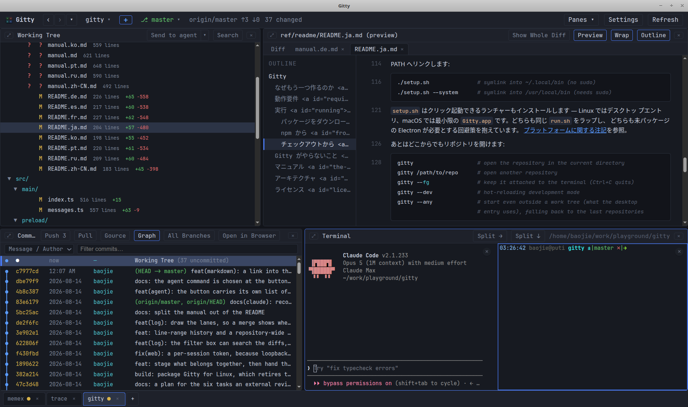

# Gitty

**English** · [简体中文](ref/readme/README.zh-CN.md) · [日本語](ref/readme/README.ja.md) · [한국어](ref/readme/README.ko.md) · [Français](ref/readme/README.fr.md) · [Deutsch](ref/readme/README.de.md) · [Español](ref/readme/README.es.md) · [Русский](ref/readme/README.ru.md) · [Português](ref/readme/README.pt.md)

*This English README is the official version and the only one kept up to date.
The translations are snapshots, each stamped with the date it was made; where
one disagrees with this file, this file is right. They cover this file only —
the [manual](ref/readme/manual.md) has translations of its own, and English is
the official version there too.*

A four-pane git history browser for the desktop, in the spirit of `lazygit` but
with real mouse interaction: double-click to open a file, right-click to copy
its path, click two commits to diff them.

```
┌──────────────────────┬──────────────────────┐
│ Working Tree         │ Diff                 │
│ (or a commit's files)│ (unified, coloured)  │
├──────────────────────┼──────────────────────┤
│ Commits              │ Terminal             │
│ (log, ↑↓, Enter)     │ (a real shell)       │
└──────────────────────┴──────────────────────┘
```

All panes are resizable by dragging the separators, and each one hides and comes
back — see [Full screen and hiding](ref/readme/manual.md#full-screen-and-hiding).

Things the other git browsers mostly do not do:

- **A real shell docked to the history.** Not a git-calling widget — a genuine
  login shell (`$SHELL`) rooted at the repository, in the same window as the
  diff, splittable into several. Most git browsers either have no terminal or
  launch an external one, so checking a hunch means alt-tabbing. Here it is
  right there, and every other pane refreshes as the repository changes.
- **Documents, not only diffs.** Markdown is rendered, HTML is shown in a
  sandboxed frame, images are shown as pictures — all at the revision you are
  on. A README from two years ago renders with the screenshots *that* commit
  shipped, read straight out of the object database — nothing on disk is
  involved, and nothing is fetched from the web, because reading someone else's
  README should not announce you to whatever host it points at.
- **Rendered markdown that can still tell you where you are in the file.** Turn
  on **Markdown source lines** and every heading, paragraph, list item, table,
  fenced block and image is numbered in the gutter with the line it starts on in
  the source — so a passage you found by reading can be edited by line.
- **A diff, a blame, a file's history and a rendered README, open at once.**
  Files open as their own tabs *beside* the diff rather than over it, each
  remembering the revision it was opened at. Reading a file never costs you the
  change you were looking at.
- **<kbd>Ctrl+F</kbd> that works in whatever the pane is showing** — including
  rendered markdown, where a phrase is found across bold and code spans because
  the search reads the rendered text, and inside the HTML preview's frame.
- **The history, served to your browser.** **Open in Browser** hands a commit —
  its metadata, its files, its diffs — to the system browser, from a web server
  inside the app on `127.0.0.1` whose URLs carry a token minted for this
  session. Commits are real URLs, so the history can be read in tabs, kept
  open, and searched with the browser's own find, for as long as the app is
  running.
- **[gource](https://gource.io/) in one click**, when it is installed: the
  repository's whole history as an animation, in its own window. Where gource is
  absent the button is not drawn — nothing is downloaded or offered that cannot
  run.
- **Nine interface languages and an explicit time zone.** Git records every
  commit with its author's offset, so a stamp is always a choice of zone; here
  you make it, and the whole UI — log, blame, file history, the boundary between
  "today" and a date — follows.



## Why another one?

Because every tool I reached for got one thing wrong:

- **IDEs** — too heavy and too slow. (Believe me, I have tried every one I could
  find.)
- **lazygit, grv** — excellent tools, but unfriendly to the mouse and to
  selecting text.
- **gitui** — I want the commit list and the diff on screen at the same time.
- **SmartGit, GitKraken** — Java, heavy, dated, and they want your money.
- **gitg** and friends — again, no commit list and diff side by side.
- **tig** — diffs only, no file tree to browse.
- **gitk** — ugly!

Two more things I wanted and almost nothing offered: a **markdown preview**, and
**copy and paste that just works** anywhere in the window.

## Requirements

- `git` on `PATH`
- Linux, macOS or Windows with a desktop session
- Node.js 22.12 or newer — only for the npm and source installs below; the `.deb`
  brings its own runtime
- Optionally [gource](https://gource.io/) on `PATH`, for
  [the animation](ref/readme/manual.md#gource); nothing changes if it is absent

## Running

### Download a package (Linux)

The `.deb` is the shortest way in — no Node, no build:

```bash
wget https://github.com/baojie/gitty/releases/download/v0.1.7/gitty-desktop_0.1.7_amd64.deb
sudo dpkg -i gitty-desktop_0.1.7_amd64.deb
```

It installs `/usr/bin/gitty`, an application-menu entry with its icon, and runs
with Chromium's sandbox **on** — see
[Linux desktop integration](ref/readme/manual.md#linux-desktop-integration).

There is an [arm64 `.deb`](https://github.com/baojie/gitty/releases/download/v0.1.7/gitty-desktop_0.1.7_arm64.deb)
beside it, and an AppImage for distributions without dpkg
([x86_64](https://github.com/baojie/gitty/releases/download/v0.1.7/Gitty-0.1.7-x86_64.AppImage),
[arm64](https://github.com/baojie/gitty/releases/download/v0.1.7/Gitty-0.1.7-arm64.AppImage)) —
the second choice, because an AppImage cannot install the sandbox helper. Older
versions are on the [releases page](https://github.com/baojie/gitty/releases).

### From npm

```bash
npm install -g gitty-desktop      # installs the gitty command globally
```

### From a checkout

Link it into your PATH with:

```bash
./setup.sh               # symlink into ~/.local/bin (no sudo)
./setup.sh --system      # symlink into /usr/local/bin (needs sudo)
```

`setup.sh` also installs a clickable launcher — a desktop entry on Linux, a
minimal `Gitty.app` on macOS. Both wrap the same `run.sh`, and both carry the
workarounds an unpackaged Electron needs; see
[Platform notes](ref/readme/manual.md#platform-notes).

Then open a repository from anywhere:

```bash
gitty                    # open the repository in the current directory
gitty /path/to/repo      # open another repository
gitty --fg               # keep it attached to the terminal (Ctrl+C quits)
gitty --dev              # hot-reloading development mode
gitty --any              # start even outside a work tree (what the desktop
                         # entry uses), falling back to the last repositories
```

Gitty detaches from the terminal and prints its pid, so the shell stays usable
and closing it does not take the window down. Output goes to
`${XDG_STATE_HOME:-~/.local/state}/gitty/gitty.log`, which is trimmed to its
last megabyte once it passes 4 MB.

`./run.sh` is the same script and works identically without the symlink. The
launcher installs dependencies and rebuilds the bundle when sources changed, so
the first run may take a moment. `npm run dev`, `npm run build` and `npm start`
are available directly as well.

Starting Gitty from a directory that is not inside a work tree falls back to the
last repository opened, instead of just complaining.

## What Gitty does not do

Gitty reads history, and stages what you decide belongs together. It does not
rebase, merge, cherry-pick, resolve conflicts, or create, delete and switch
branches — and it will not learn to. Those are stateful, several-step
operations whose interesting moments are the ones where something goes wrong,
and a shell that handles all of them is docked in the same window, already in
the right directory. Half a rebase button is worse than none.

There is no commit box either, which is a smaller claim than it sounds. The
message is not the missing piece: what is missing is somewhere to decide *which
changes are one commit*, and that is what the staging above is for. Once the
index says one thing, **Send** hands it to whatever writes your
messages.

## The manual

The rest — every pane, every setting, every shortcut — is in
**[the manual](ref/readme/manual.md)**:

- [The window](ref/readme/manual.md#the-window): the title bar, going back, tabs,
  recent repositories, full screen and hiding panes.
- [The panes](ref/readme/manual.md#the-panes): the working tree and staging, the
  diff, viewing files and rendered documents, the commit log and its graph,
  the terminal.
- [Finding text](ref/readme/manual.md#finding-text), the
  [settings table](ref/readme/manual.md#settings) and the
  [keyboard shortcuts](ref/readme/manual.md#keyboard-shortcuts).
- [Platform notes](ref/readme/manual.md#platform-notes): Linux desktop integration
  and the macOS app bundle.

## Architecture

```
src/main       Electron main process — git commands, ptys, fs watchers,
               the recent-repository store, IPC
src/preload    contextBridge API exposed to the renderer as window.gitty
src/renderer   React UI — App.tsx manages tabs, RepoTab.tsx owns one
               repository's four panes
src/shared     Types shared by both sides
build          Application icon (SVG source and rendered PNG)
```

Git is driven through `execFile('git', …)` with `--porcelain=v2 -z` /
`--name-status -z` parsing, so paths with spaces and renames survive. No git
library is bundled; whatever `git` is on `PATH` is what you see. The renderer
runs with `contextIsolation` and no node integration.

The renderer is split into lazy-loaded chunks so the window paints before
xterm, highlight.js and markdown-it are parsed. The split — the four chunks,
the rules for keeping heavy libraries out of warm ones, and how to add a new
one — is specified in [ref/spec/lazy-loading.md](ref/spec/lazy-loading.md).

## Licence

MIT
