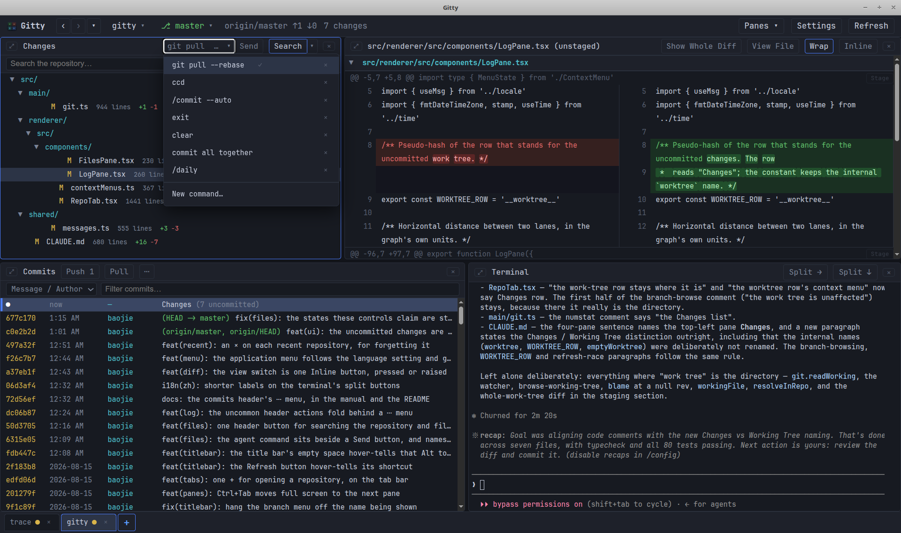

# Gitty

[English](../../README.md) · [简体中文](README.zh-CN.md) · [日本語](README.ja.md) · [한국어](README.ko.md) · [Français](README.fr.md) · **Deutsch** · [Español](README.es.md) · [Русский](README.ru.md) · [Português](README.pt.md)

> **Übersetzt am 2026-08-16.**
> Die [englische README](../../README.md) ist die offizielle Fassung und die
> einzige, die weiter gepflegt wird. Dieses Dokument ist eine Momentaufnahme
> davon; wo beide sich widersprechen, gilt das Englische. Dieses Dokument deckt
> nur diese Datei ab — das [Handbuch](manual.de.md) hat seine eigenen
> Übersetzungen, und auch dort ist Englisch die offizielle Fassung. Die
> Oberfläche selbst ist englisch, deshalb bleiben Schaltflächen- und Menünamen
> im Original.

Ein Vier-Bereiche-Browser für die Git-Historie auf dem Desktop, im Geiste von
`lazygit`, aber mit echter Mausbedienung: Doppelklick öffnet eine Datei,
Rechtsklick kopiert ihren Pfad, zwei angeklickte Commits werden verglichen.

```
┌──────────────────────┬──────────────────────┐
│ Changes              │ Diff                 │
│ (or a commit's files)│ (unified, coloured)  │
├──────────────────────┼──────────────────────┤
│ Commits              │ Terminal             │
│ (log, ↑↓, Enter)     │ (a real shell)       │
└──────────────────────┴──────────────────────┘
```

Alle Bereiche lassen sich an den Trennern in der Größe ändern, und jeder lässt
sich ausblenden und wieder hervorholen — siehe
[Vollbild und Ausblenden](manual.de.md#full-screen-and-hiding).

Dinge, die die anderen Git-Browser meist nicht tun:

- **Eine echte Shell, angedockt an die Historie.** Kein Widget, das git aufruft,
  sondern eine echte Login-Shell (`$SHELL`) mit Wurzel im Repository, im selben
  Fenster wie das Diff, in mehrere teilbar. Die meisten Git-Browser haben
  entweder kein Terminal oder starten ein externes, also heißt eine Vermutung
  prüfen: Fenster wechseln. Hier ist es gleich da, und jeder andere Bereich
  aktualisiert sich, wenn sich das Repository ändert.
- **Staging, das bei einem Agenten endet, nicht in einem Commit-Feld.** Stage
  eine Datei, einen Hunk oder nur die Zeilen, die du ausgewählt hast; **Send**
  tippt dann deinen eigenen Befehl — `claude "commit the staged changes"`,
  `codex exec …`, was auch immer du ausführst — in die Shell darunter und drückt
  Enter. Die Nachricht zu schreiben ist Sache des Agenten. Zu entscheiden,
  *welche Änderungen ein Commit sind*, ist deine, und dafür sind die vier
  Bereiche da. Aus Gitty heraus wird kein Modell aufgerufen, also verlässt nichts
  die Maschine, was du nicht selbst gesendet hast.
- **Dokumente, nicht nur Diffs.** Markdown wird gerendert, HTML in einem
  Sandbox-Rahmen gezeigt, Bilder als Bilder angezeigt — alles in der Revision,
  in der man gerade ist. Ein zwei Jahre altes README rendert mit den Screenshots,
  die *jener* Commit ausgeliefert hat, direkt aus der Objektdatenbank gelesen —
  nichts auf der Platte ist beteiligt, und nichts wird aus dem Netz geholt, denn
  das README eines Fremden zu lesen sollte einen nicht bei dessen Host anmelden.
- **Gerendertes Markdown, das einem noch sagt, wo man in der Datei ist.**
  **Markdown source lines** einschalten, und jede Überschrift, jeder Absatz,
  jeder Listeneintrag, jede Tabelle, jeder Codeblock und jedes Bild bekommt im
  Rand die Zeilennummer, mit der es in der Quelle beginnt — sodass eine Stelle,
  die man lesend gefunden hat, zeilengenau bearbeitet werden kann.
- **Ein Diff, ein Blame, die Historie einer Datei und ein gerendertes README, auf
  einmal offen.** Dateien öffnen als eigene Tabs *neben* dem Diff statt darüber,
  und jede merkt sich die Revision, in der sie geöffnet wurde. Eine Datei zu
  lesen kostet einen nie die Änderung, die man gerade ansah.
- **<kbd>Strg+F</kbd>, das in allem funktioniert, was der Bereich zeigt** —
  einschließlich gerendertem Markdown, wo ein Ausdruck über Fett- und Code-Spans
  hinweg gefunden wird, weil die Suche den gerenderten Text liest, und im Rahmen
  der HTML-Vorschau.
- **Die Historie, an deinen Browser ausgeliefert.** **Open in Browser** reicht
  einen Commit — seine Metadaten, seine Dateien, seine Diffs — an den
  System-Browser weiter, von einem Webserver in der Anwendung, der an
  `127.0.0.1` gebunden ist — dein eigener Browser und sonst niemand. Commits sind
  echte URLs, also lässt sich die Historie in Tabs lesen, offen halten und mit
  der Suche des Browsers durchsuchen, solange das Repository offen ist.
- **[gource](https://gource.io/) aus dem Commits-Menü**, wenn es installiert ist:
  die ganze Historie des Repositories als Animation, in einem eigenen Fenster. Wo
  gource fehlt, wird der Eintrag nicht gezeichnet — es wird nichts
  heruntergeladen oder angeboten, was nicht laufen kann.
- **Neun Oberflächensprachen und eine explizite Zeitzone.** Git speichert jeden
  Commit mit dem Versatz seines Autors, also ist ein Zeitstempel immer eine Wahl
  der Zone; hier trifft man sie, und die ganze Oberfläche — Log, Blame,
  Datei-Historie, die Grenze zwischen „heute" und einem Datum — folgt.



## Warum noch einer? <a id="why-another-one"></a>

Weil jedes Werkzeug, zu dem ich griff, eine Sache falsch machte:

- **IDEs** — zu schwer und zu langsam. (Glaubt mir, ich habe jede probiert, die
  ich finden konnte.)
- **lazygit, grv** — hervorragende Werkzeuge, aber unfreundlich zur Maus und zum
  Markieren von Text.
- **gitui** — ich will Commit-Liste und Diff gleichzeitig auf dem Schirm.
- **SmartGit, GitKraken** — Java, schwer, angestaubt, und sie wollen Geld.
- **gitg** und Verwandte — wieder keine Commit-Liste und kein Diff nebeneinander.
- **tig** — nur Diffs, kein Dateibaum zum Stöbern.
- **gitk** — hässlich!

Zwei weitere Dinge, die ich wollte und die fast niemand bot: eine
**Markdown-Vorschau** und **Kopieren und Einfügen, das funktioniert** — überall
im Fenster.

## Voraussetzungen <a id="requirements"></a>

- Node.js 20 oder neuer
- `git` im `PATH`
- Linux, macOS oder Windows mit einer Desktop-Sitzung
- Optional [gource](https://gource.io/) im `PATH`, für
  [die Animation](manual.de.md#gource); nichts ändert sich, wenn es fehlt

## Starten <a id="running"></a>

### Ein Paket herunterladen (Linux) <a id="download-a-package-linux"></a>

Die `.deb`-Datei ist der kürzeste Weg — kein Node, kein Build:

```bash
wget https://github.com/baojie/gitty/releases/download/v0.1.8/gitty-desktop_0.1.8_amd64.deb
sudo dpkg -i gitty-desktop_0.1.8_amd64.deb
```

Sie installiert `/usr/bin/gitty`, einen Eintrag im Anwendungsmenü mit Symbol, und
läuft mit Chromiums Sandbox **an** — siehe
[Linux-Desktop-Integration](manual.de.md#linux-desktop-integration).

Daneben liegen ein [arm64-`.deb`](https://github.com/baojie/gitty/releases/download/v0.1.8/gitty-desktop_0.1.8_arm64.deb)
und ein AppImage für Distributionen ohne dpkg
([x86_64](https://github.com/baojie/gitty/releases/download/v0.1.8/Gitty-0.1.8-x86_64.AppImage),
[arm64](https://github.com/baojie/gitty/releases/download/v0.1.8/Gitty-0.1.8-arm64.AppImage)) —
die zweite Wahl, weil ein AppImage den Sandbox-Helfer nicht installieren kann.
Ältere Fassungen liegen auf der
[Releases-Seite](https://github.com/baojie/gitty/releases).

### Aus npm <a id="from-npm"></a>

```bash
npm install -g gitty-desktop      # installs the gitty command globally
```

### Aus einem Checkout <a id="from-a-checkout"></a>

In den PATH verlinken:

```bash
./setup.sh               # symlink into ~/.local/bin (no sudo)
./setup.sh --system      # symlink into /usr/local/bin (needs sudo)
```

`setup.sh` installiert außerdem einen anklickbaren Starter — einen Desktop-Eintrag
unter Linux, ein minimales `Gitty.app` unter macOS. Beide packen dasselbe
`run.sh` ein, und beide tragen die Behelfe, die ein unverpacktes Electron braucht;
siehe [Plattform-Hinweise](manual.de.md#platform-notes).

Dann von überall ein Repository öffnen:

```bash
gitty                    # open the repository in the current directory
gitty /path/to/repo      # open another repository
gitty --fg               # keep it attached to the terminal (Ctrl+C quits)
gitty --dev              # hot-reloading development mode
gitty --any              # start even outside a work tree (what the desktop
                         # entry uses), falling back to the last repositories
```

Gitty löst sich vom Terminal und gibt seine pid aus, sodass die Shell nutzbar
bleibt und ihr Schließen das Fenster nicht mitnimmt. Die Ausgabe geht nach
`${XDG_STATE_HOME:-~/.local/state}/gitty/gitty.log` und wird auf das letzte
Megabyte gekürzt, sobald sie 4 MB überschreitet.

`./run.sh` ist dasselbe Skript und funktioniert ohne den Symlink genauso. Der
Starter installiert Abhängigkeiten und baut das Bundle neu, wenn sich Quellen
geändert haben — der erste Start kann also einen Moment dauern. `npm run dev`,
`npm run build` und `npm start` stehen ebenfalls direkt zur Verfügung.

Wird Gitty aus einem Verzeichnis gestartet, das in keinem Arbeitsverzeichnis
liegt, greift es auf das zuletzt geöffnete Repository zurück, statt sich nur zu
beschweren.


## Was Gitty nicht tut <a id="what-gitty-does-not-do"></a>

Gitty liest die Historie und staget, was du als zusammengehörig bestimmst. Es
macht kein rebase, merge, cherry-pick, keine Konfliktlösung und kein Erstellen,
Löschen oder Wechseln von Branches — und es wird es auch nicht lernen. Das sind
zustandsbehaftete, mehrschrittige Vorgänge, deren interessante Momente die sind,
in denen etwas schiefgeht; und eine Shell, die all das beherrscht, ist im selben
Fenster angedockt, schon im richtigen Verzeichnis. Ein halber Rebase-Knopf ist
schlimmer als keiner.

Einen Commit-Kasten gibt es ebenfalls nicht, was eine kleinere Behauptung ist, als
sie klingt. Was fehlt, ist nicht die Nachricht: Es fehlt ein Ort, um zu
entscheiden, *welche Änderungen ein Commit sind* — und genau dafür ist das Staging
oben da. Sobald der Index eine Sache sagt, reicht **Send** sie an das
weiter, was deine Nachrichten schreibt.

## Das Handbuch <a id="the-manual"></a>

Der Rest — jeder Bereich, jede Einstellung, jeder Shortcut — steht im
**[Handbuch](manual.de.md)**:

- [Das Fenster](manual.de.md#the-window): die Titelleiste, Zurückgehen, Tabs,
  zuletzt geöffnete Repositories, Vollbild und Ausblenden von Bereichen.
- [Die Bereiche](manual.de.md#the-panes): Arbeitsbaum und Staging, das Diff, das
  Ansehen von Dateien und gerenderten Dokumenten, das Commit-Log und sein Graph,
  das Terminal.
- [Textsuche](manual.de.md#finding-text), die
  [Einstellungstabelle](manual.de.md#settings) und die
  [Tastaturkürzel](manual.de.md#keyboard-shortcuts).
- [Plattform-Hinweise](manual.de.md#platform-notes): Linux-Desktop-Integration
  und das macOS-App-Bundle.

## Architektur <a id="architecture"></a>

```
src/main       Electron main process — git commands, ptys, fs watchers,
               the recent-repository store, IPC
src/preload    contextBridge API exposed to the renderer as window.gitty
src/renderer   React UI — App.tsx manages tabs, RepoTab.tsx owns one
               repository's four panes
src/shared     Types shared by both sides
build          Application icon (SVG source and rendered PNG)
```

git wird über `execFile('git', …)` angesteuert, mit Auswertung von
`--porcelain=v2 -z` / `--name-status -z`, sodass Pfade mit Leerzeichen und
Umbenennungen heil bleiben. Es wird keine Git-Bibliothek mitgeliefert; was immer
als `git` im `PATH` liegt, ist das, was man sieht. Der Renderer läuft mit
`contextIsolation` und ohne Node-Integration.

Der Renderer ist in verzögert geladene Chunks aufgeteilt, damit das Fenster
gezeichnet wird, bevor xterm, highlight.js und markdown-it geparst sind. Diese
Aufteilung — die vier Chunks, die Regeln, um schwere Bibliotheken aus warmen
Chunks herauszuhalten, und wie man eine neue hinzufügt — ist in
[ref/spec/lazy-loading.md](../../ref/spec/lazy-loading.md) festgelegt.


## Lizenz <a id="licence"></a>

MIT

