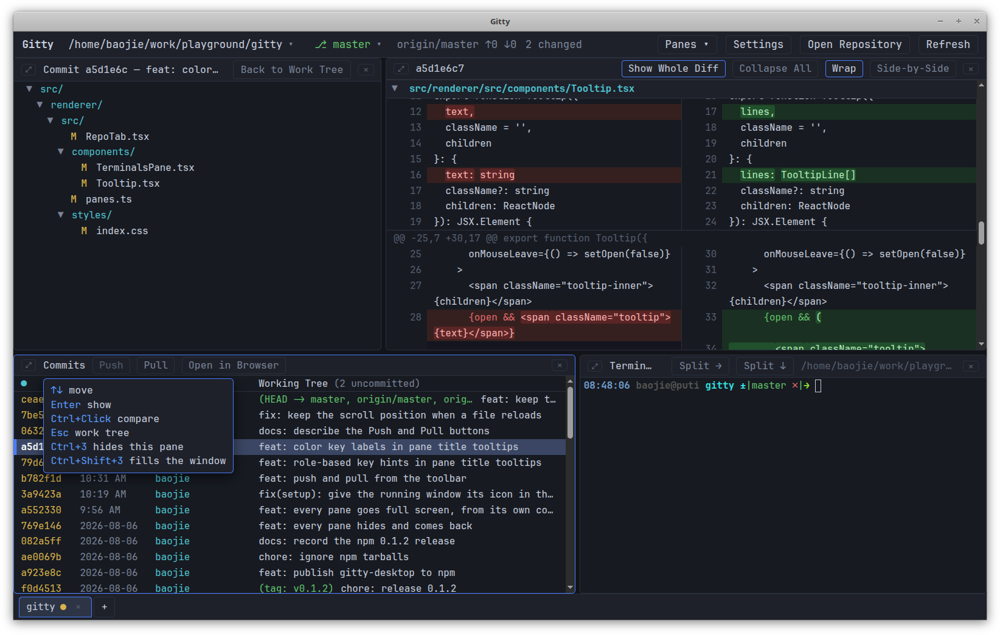

# Gitty

[English](../../README.md) · [简体中文](README.zh-CN.md) · **日本語** · [Español](README.es.md) · [Français](README.fr.md) · [Deutsch](README.de.md)

> **翻訳日: 2026-08-07。**
> 公式版は[英語版 README](../../README.md) であり、継続的に更新されるのはそちらだ
> けです。この文書はその時点のスナップショットで、食い違いがある場合は英語版が正
> です。UI 自体は英語なので、ボタン名やメニュー項目は原文のまま残しています。

デスクトップ向けの 4 ペイン構成の git 履歴ブラウザ。`lazygit` の系譜にありながら、
マウス操作が本物です。ダブルクリックでファイルを開き、右クリックでパスをコピー
し、コミットを 2 つクリックすれば差分が出ます。

```
┌──────────────────────┬──────────────────────┐
│ Working Tree         │ Diff                 │
│ (or a commit's files)│ (unified, coloured)  │
├──────────────────────┼──────────────────────┤
│ Commits              │ Terminal             │
│ (log, ↑↓, Enter)     │ (a real shell)       │
└──────────────────────┴──────────────────────┘
```

すべてのペインは仕切りをドラッグしてサイズを変えられ、どれも隠して呼び戻せます —
[全画面と非表示](#full-screen-and-hiding)を参照。

他の git ブラウザではあまり見かけない点:

- **履歴の隣に本物のシェルが常駐。** git を呼ぶだけのウィジェットではなく、リポジ
  トリをルートとする本物のログインシェル (`$SHELL`) が、差分と同じウィンドウにあり
  ます。多くの git ブラウザはターミナルを外に置くので、思いつきを確かめるだけでウィ
  ンドウを行き来することになります。ここではすぐそこにあり、リポジトリが変われば他
  のペインもすべて更新されます。
- **コミットを一度に 2 つ。** 1 つクリックし、<kbd>Ctrl+click</kbd> /
  <kbd>Shift+click</kbd> で 2 つ目を選べば、その場で差分が出ます。多くのブラウザは
  コミットを親とだけ、あるいはダイアログで選んだツリーとだけ比較できます。
- **チェックアウトせずに任意のブランチを閲覧。** ブランチを選べばその履歴すべてが読
  めます。ワークツリー、差分、ターミナルは git が残したままの状態です。作業ディレク
  トリの中身は一切動きません。
- **Markdown プレビューを内蔵。** `.md` の変更を選ぶとドキュメントが描画されます —
  コードはシンタックスハイライトされ、アウトラインはスクロールに追従します。しかも
  作業コピーだけでなく、いま見ているリビジョンのものが表示されます。
- **差分全体を、各ファイルの見出しを固定したまま。** 何も選ばなければ全変更が一度に
  見え、いま読んでいるファイルの見出しはペイン上端に貼り付いたまま、次のファイルの
  見出しが押し出すまで残ります。
- **テキストの選択とコピーがそのまま動く** — マウスモードもレジスタもキーボードの曲
  芸も不要。ウィンドウ内のどこでも、選んでコピーできます。
- **どのペインもサイズ変更・非表示・全画面が可能** — 4 ペインのレイアウトが差分だけ
  に、あるいはログだけに縮み、また戻ってきます。



## なぜもう一つ作るのか <a id="why-another-one"></a>

手に取ったツールがどれも一点ずつ外していたからです:

- **各種 IDE** — 重すぎ、遅すぎ。(本当に、見つけられる限り全部試しました。)
- **lazygit、grv** — 優れたツールですが、マウスとテキスト選択に不親切。
- **gitui** — コミット一覧と差分を同時に画面に置きたい。
- **SmartGit、GitKraken** — Java、重い、古臭い、しかも有料。
- **gitg** の類 — これもコミット一覧と差分が並びません。
- **tig** — 差分のみで、辿れるファイルツリーがない。
- **gitk** — 見た目が!

さらに、欲しかったのにほとんど提供されていなかったものが 2 つ: **Markdown プレ
ビュー**と、ウィンドウのどこでも**まともに動くコピー & ペースト**です。

## 動作要件 <a id="requirements"></a>

- Node.js 20 以降
- `PATH` 上に `git`
- デスクトップセッションのある Linux、macOS または Windows

## 実行 <a id="running"></a>

`gitty` コマンドを一度インストールします:

```bash
npm install -g gitty-desktop      # installs the gitty command globally
```

あるいはチェックアウトから PATH へリンクします:

```bash
./setup.sh               # symlink into ~/.local/bin (no sudo)
./setup.sh --system      # symlink into /usr/local/bin (needs sudo)
```

`setup.sh` の経路ではデスクトップランチャーも入ります。アイコンが hicolor テーマに
追加され、アプリケーションメニューに `gitty.desktop` エントリが現れます (セッション
にデスクトップがあればデスクトップ上にも)。その後アイコンキャッシュと desktop データ
ベースが更新されるので、エントリはアイコン付きですぐ出てきます。(Linux では回避策が
1 つ入り、サンドボックスのフラグが 1 つ切られています —
[Linux デスクトップ統合](#linux-desktop-integration)を参照。)

あとはどこからでもリポジトリを開けます:

```bash
gitty                    # open the repository in the current directory
gitty /path/to/repo      # open another repository
gitty --fg               # keep it attached to the terminal (Ctrl+C quits)
gitty --dev              # hot-reloading development mode
gitty --any              # start even outside a work tree (what the desktop
                         # entry uses), falling back to the last repositories
```

Gitty はターミナルから切り離れて自分の pid を表示するので、シェルはそのまま使え、閉
じてもウィンドウは道連れになりません。出力は
`${XDG_STATE_HOME:-~/.local/state}/gitty/gitty.log` へ書かれ、4 MB を超えると末尾
1 MB に切り詰められます。

`./run.sh` は同じスクリプトで、シンボリックリンクなしでも同じように動きます。ラン
チャーはソースが変わっていれば依存をインストールしてバンドルを再ビルドするので、初回
は少し待つことがあります。`npm run dev`、`npm run build`、`npm start` も直接使えま
す。

ワークツリー外のディレクトリから起動した場合、Gitty は文句を言うだけで終わらず、最後
に開いたリポジトリにフォールバックします。

## ウィンドウ <a id="the-window"></a>

中央に 4 つのペイン、その上にタイトルバー、下にタブバー。

### タイトルバー <a id="title-bar"></a>

左から右へ、まず現在のリポジトリを説明し、それから操作します:

- **リポジトリのパス**はボタンで、[最近のリポジトリ](#recent-repositories)メニューを
  開きます。
- **⎇ ブランチ**もボタンです — git がチェックアウトしているブランチを示し、読むため
  の他ブランチのメニューを出します。[別のブランチを閲覧](#browsing-another-branch)を
  参照。
- **`origin/main ↑2 ↓0`** — チェックアウト中のブランチの上流と、その先行・遅れの
  数。追跡していないブランチでは表示されません。
- **`3 changed`** — ワークツリーで未コミットのファイル数。コミットペインの
  **Working Tree** 行が持つ数と同じものです。
- **Panes ▾** — 4 つのペインの表示・非表示。
  [全画面と非表示](#full-screen-and-hiding)を参照。
- **Settings** — 設定ダイアログ ([設定](#settings))。<kbd>Ctrl+,</kbd> でも開きま
  す。
- **Open Repository** — ディレクトリ選択ダイアログ。新しいタブで開きます
  (<kbd>Ctrl+O</kbd>)。
- **Refresh** — ステータスとログを手動で読み直します (<kbd>F5</kbd> /
  <kbd>Ctrl+R</kbd>)。Gitty はリポジトリを監視して自動で更新するので、これは監視が気
  づけない場合のためのものです。

別のブランチを見ている間、ブランチボタンは `⎇ main › other-branch` と表示され、直前
の git コマンドのエラーは数値の隣に赤字で出ます。

### タブ <a id="tabs"></a>

下端のタブバーが開いているリポジトリをすべて並べます — ベース名、ワークツリーに未コ
ミットの変更があるときの黄色い点、そして閉じる **×**。この点は `git status` が報告す
るもの全部を数え、追跡されていないファイルも含みます。そして真価を発揮するのは、いま
見ていないタブの上です。アクティブなリポジトリはタイトルバーに既に `3 changed` と出
ていますが、背面のタブは完全に隠れているので、この点だけが「あちらにまだ仕事が残って
いる」という唯一の合図になります。タブにカーソルを合わせると、リポジトリ名とその旨が
言葉で出ます。

**+** (および <kbd>Ctrl+O</kbd>) は別のリポジトリを新しいタブで開きます。タイトルバー
は常にアクティブなものを示します。各タブは自分のペインとターミナルを保持するので、読
みかけのコミットも走らせたままのシェルも、切り替えて戻ってきたときそのままです。最後
のタブを閉じると、次のリポジトリを開くボタンだけの空のウィンドウが残ります。(開いてい
るタブは再起動をまたいで記憶されません。)

### 最近のリポジトリ <a id="recent-repositories"></a>

タイトルバーのリポジトリパスは、以前に開いたリポジトリのメニューです — ベース名と親
ディレクトリ、新しい順。

- **クリック** — 新しいタブで開く。
- **Ctrl/Cmd+クリック**または**中クリック** — 現在のタブで開き、そこのリポジトリを置
  き換えつつ、バー内でのタブの位置は保つ。
- **右クリック** — その項目を一覧から削除。メニューは開いたままなので、続けていくつも
  消せます。

その下に **Open Repository…** と **Clear Recent** があります。一覧は
`~/.config/Gitty/recent-repos.json` にあり、12 件を保持し、移動・削除されたものは飛ば
します。

### 全画面と非表示 <a id="full-screen-and-hiding"></a>

どのペインのヘッダーも同じ 2 つのコントロールを持ちます。左端の **⤢** がそのペインで
ウィンドウを埋め、右端の **×** がそれを隠します。

全画面はタイトルバーとタブバーを含む他のすべてを覆いますが、下のペインは動き続けま
す — ターミナルは覆われている間も走り続けます。同じ角の **⤡**、<kbd>Esc</kbd>、ヘッ
ダーのダブルクリック、あるいは <kbd>Ctrl+Shift+1</kbd> … <kbd>Ctrl+Shift+4</kbd> でレ
イアウトが戻ります。全画面になれるのは一度に 1 つだけです。

非表示は逆方向で、どのペインも片付けて呼び戻せます:

- タイトルバーの **Panes** が 4 つすべてを並べ、表示中のものには点が付きます。クリッ
  クで切り替わり、**Show All Panes** が 4 ペインのレイアウトを復元します。
- <kbd>Ctrl+1</kbd> … <kbd>Ctrl+4</kbd> がこの順に Files、Diff、Commits、Terminal を
  切り替えます。

残ったものがウィンドウを分け合うので、コミットペインを隠せば差分が全高を得ます。最後
に残った 1 つのペインには **×** がありません — 空のウィンドウでは押すものが無くなるか
らです。非表示の状態は再起動をまたいで記憶され、ターミナルペインは片付けられるだけで
決して閉じられません。シェルは走り続け、戻るときスクロールバックごと戻ってきます。

## 各ペイン <a id="the-panes"></a>

### Working Tree (左上) <a id="working-tree-top-left"></a>

変更されたファイルを折りたためるツリーで表示し、名前の横に行数を添えます。ステータス
は 2 列 — ステージ済みの状態 (緑) とワークツリーの状態 (黄 / 赤)。追跡されていない
ファイルは `??` です。行数はワークツリーではディスクから、それ以外ではそのリビジョン
から数えます。バイナリファイル、削除されたファイル、8 MB を超えるものには表示されま
せん。

- **クリック** — そのファイルの差分を右に表示。
- **ダブルクリック** — ファイル全体を差分の隣にドキュメントとして開く。行番号とシンタッ
  クスハイライト付き (Markdown なら描画済みのドキュメント、画像なら画像そのもの)。
- **右クリック** — View File、Open in System App、Reveal in File Manager、Copy
  Relative Path、Copy Absolute Path、Copy File Name。
- **フォルダをクリック** — 折りたたみ / 展開。

コミットやコミット範囲を選ぶと、このペインは代わりにそのコミットのファイルを並べま
す。**Back to Work Tree** (または <kbd>Esc</kbd>) でワークツリーへ戻ります。
[スナップショット](#snapshots)では、変更分だけでなくそのコミット時点のツリー全体を並
べます。

### Diff (右上) <a id="diff-top-right"></a>

新旧の行番号、hunk ヘッダー、追加 / 削除の色分けを備えた unified 差分を、ファイルの
リストとして並べます。各パスは全幅の見出し、hunk ヘッダーは淡色 — それは行範囲であっ
て真っ先に見るものではないからです — リネームは `old → new` と読めます。ファイルを選
んでいなければ全部を一度に表示します。ワークツリーの未コミット変更すべて、あるいは選
択したコミットの全ファイルです。

- **Show Whole Diff** — ファイルを選んだ後、その統合差分へ戻ります。ヘッダーに常駐
  し、いま画面に出ているのが差分全体であるときは点灯します。ワークツリー版はステージ
  済みと未ステージの変更をまとめて扱い、`git diff` だけでは漏れる追跡外ファイルも
  インライン展開します (50 件まで、その先は通知)。
- **Wrap** — 横スクロールの代わりに長い行を折り返します。既定でオン。
- **Inline / Side-by-Side** — `+`/`-` 記号付きの 1 列か、新旧を左右に並べるか。後者
  では削除の連続とそれに続く追加が組にされます。折り返された左右は揃ったままです。
- **ファイル見出し** — 各見出しが自分のファイルを畳みます。三角形で名前だけに縮み、
  ヘッダーの **Collapse All** / **Expand All** が一括で行います。見出しを
  **Ctrl+クリック**するとそのファイルが新しいドキュメントタブで開き、右クリックで
  **Open in a New Tab**、**Select in the File List**、各種パスのコピー、そして — ディ
  スク上のファイルが表示中の版そのものであるワークツリーでは — **Open in System App**
  と **Reveal in File Manager** が出ます。リネームは新しいパスを開きます。
- **右クリック** — Copy Selection、Copy Whole Diff、および同じトグル群。

行全体より語単位のほうが読みやすい場合、変更行の中で変わった語が強調されます。
[設定](#settings)の **Word highlight** です。

設定は実行をまたいで記憶されます。行は 1500 ずつのかたまりで描画されスクロールに応じ
て伸びるので、大きなコミットでも軽快です。2 MB を超える差分は通知付きで切り詰められ
ます。

### ファイル全体を見る <a id="viewing-files"></a>

既定で表示されるのは差分ですが、どのファイルも丸ごと開けます。ツリーで**ダブルクリッ
ク**するか、ヘッダーの **View File** / **Preview** を使うか、差分の中のファイル見出し
を **Ctrl+クリック**するか、どちらかのコンテキストメニューから選びます。

ファイルは差分の上にではなく*隣*のタブ列に独立したドキュメントとして開くので、いま見
ている差分を失わずにファイルを読めます。**Diff** タブは常に先頭にあり、ツリーでのシン
グルクリックはこれまで通りその場で差分を辿ります。各ドキュメントは開いたときのリビ
ジョンを覚え、自分の **×** で閉じ、リポジトリが変わればワークツリーのファイルを読み
直します。ソースファイルには行番号とシンタックスハイライトが付き、Markdown は
[描画された状態](#markdown-preview)で開いてソースへ切り替えられ、画像は
[画像そのもの](#images)として開きます。

どのリビジョンが得られるかはペインに従います。ワークツリーではディスク上のファイル、
それ以外では選択中のコミット時点のファイルです。ドキュメントを開くのはモードではなく
動作です — 別のファイルや別のコミットを選べば差分が戻ります — なので、変更を見たいと
きにペインがファイル表示のまま動かなくなることはありません。

#### スナップショット <a id="snapshots"></a>

コミットを右クリックして **Browse Snapshot** を選ぶと、そのコミット時点のリポジトリを
読めます。左上のペインはそのコミットが触れたファイルではなく*ツリー全体*を並べ、どの
ファイルを選んでもそのリビジョンで開きます。スナップショットには見せる差分がないの
で、そこではすべてのファイルがドキュメントです。

スナップショットのファイルはそのリビジョンにおいてディスク上に存在したことがありませ
ん。だから **Open in System App** は一時コピーを渡し、**Reveal in File Manager** はそ
もそも提供されません。**Back to Work Tree** (または <kbd>Esc</kbd>) で抜けます。

#### Markdown プレビュー <a id="markdown-preview"></a>

`.md` ファイルを選ぶと **Preview** ボタンが増えます — 既定はオフなので、頼むまで差分
は差分のままです。ファイルを丸ごと描画します。ワークツリーではディスク上の版、それ以
外では選択中のコミット時点の版です。

言語が指定されたフェンス付きコードブロックはシンタックスハイライトされ、YAML フロント
マターは抜き出されて独立したハイライト済みブロックとして表示され、見出しレベル、リス
トの記号、リンク、インラインコードは色分けされて構造が一目で読めます。

- **Wrap** — 差分と同じトグルで、既定はオン。地の文は常に折り返します。プレビューでは
  このトグルが、フェンス付きコードブロック・幅広の表・長いインライン文字列も折り返す
  か、それとも横スクロールにするかを決めます。
- **Outline** — ドキュメントの脇に見出し構造をレベルごとに字下げして表示し、スクロール
  した先の見出しに追従します。項目をクリックすると飛べます。
- **右クリック** — Copy Selection、Copy Markdown Source、折り返しとアウトラインのトグ
  ル、そして Show Diff Instead。

Markdown 中の生 HTML は描画されず、リンクはアプリ内ではなくシステムのブラウザで開きま
す。ドキュメントからの相対パスで書かれた画像はリポジトリから読み出されます — ドキュメ
ントと同じリビジョンなので、古いコミットは当時のスクリーンショットを見せます。そのリ
ビジョンに無いものは alt テキストを添えた破線のプレースホルダーになります。ウェブ上の
画像は一切取得しません。他人の README を読むのに、その相手のホストへ挨拶しに行く必要
はありません。

#### 画像 <a id="images"></a>

`.png`、`.jpg`、`.gif`、`.webp`、`.bmp`、`.ico`、`.avif`、`.svg` は「バイナリです」と
いう報告ではなく画像そのものとして開きます — ワークツリーではディスクから、それ以外で
はコミットから。市松模様の上でペインに合わせて表示されるので、透明は透明として読めま
す。**クリック**すると実寸になりスクロールでき、もう一度クリックすると再びフィットし
ます。ピクセル寸法とディスク上のサイズが下に出ます。12 MB を超える画像はインライン展
開されません。

### Commits (左下) <a id="commits-bottom-left"></a>

現在のブランチのログ。300 件ずつ読み込み、スクロールに応じて伸びます。先頭行は
**Working Tree** — 未コミットの変更で、変更ファイル数付き。選ぶと上の 2 ペインがワー
クツリーに戻ります。

- **クリック**または <kbd>Enter</kbd> — そのコミットを表示。ファイルが左上、完全な差
  分が右上を埋めます。
- **Ctrl+クリック** (macOS では <kbd>Cmd</kbd>)、<kbd>Shift+クリック</kbd>、
  <kbd>Space</kbd> — 2 つ目のコミットを選び、古い方を先にして両者を比較。
- **↑ ↓ / j k / PgUp / PgDn / Home / End** — カーソル移動。
- **右クリック** — 差分を表示、ハッシュ・短縮ハッシュ・件名をコピー、
  [スナップショットを閲覧](#snapshots)、あるいは選択中のコミットと比較。
- **右クリック → Open in Browser** — このコミットをシステムのブラウザで描画。
  **Copy Commit URL** はリンクをコピーします。アプリ内の Web サーバー (`127.0.0.1`
  のみを待ち受け、自分のブラウザのため) が、開いている各リポジトリを辿れるコミット一覧
  として提供します — コミットペインの **Open in Browser** ボタンはそこへ着地します —
  各コミットのメタデータ、ファイル、差分があり、ファイル単位の差分もワンクリックで
  す。URL はリポジトリが開いている間有効です。
- 左上のペインでファイルを選ぶと差分がそのファイルに絞られ、**Show Whole Diff** でま
  た広がります。

#### 別のブランチを閲覧 <a id="browsing-another-branch"></a>

タイトルバーのブランチは、ローカルとリモート追跡のすべてのブランチを新しいコミット順
に並べたメニューを開き、選ぶとそのブランチの履歴を表示します。読むだけの覗き見です。
gitty は `checkout` を実行しないので、ワークツリーもその差分もターミナルも git が残し
た場所のままです。別のブランチを見ている間、タイトルバーは `⎇ main › other-branch` と
表示され、コミットペインはどのブランチを並べているかを述べます。
**Back to \<branch\>** で戻ります。各タブは独立して閲覧します。

#### Push と Pull <a id="push-and-pull"></a>

**Push** と **Pull** はヘッダーにあり、ログがどのブランチを向いていても、両方ともチェッ
クアウト中のブランチに作用します。**Push** は未プッシュの数を数え — **Push 3** — 送る
ものが無ければ灰色になります。追跡していないブランチでは、そのブランチを `origin` に公
開して上流を設定します。**Pull** は上流から早送りし、上流が無ければ灰色です。git が
言ったことはログの上に出ます — クリックで消え、失敗は消すまで残ります。

どちらもプロンプトには答えられません。背後にターミナルが無いので、パスワードやパスフ
レーズを求める push はぶら下がらずに git 自身のメッセージで失敗し、早送りできない
pull もそう言います。その後はどちらもすぐ隣のターミナルペインで手作業で片付けます。

### Terminal (右下) <a id="terminal-bottom-right"></a>

リポジトリをルートとする本物の対話的ログインシェル (`$SHELL`) なので、どんな git コマ
ンドも直接実行できます。リポジトリがディスク上で変われば、他のペインは自動的に更新さ
れます。

このペインは好きなだけシェルに分割できます。**Split →** はフォーカス中のターミナルの
隣に、**Split ↓** はその下に新しいものを置き、間の仕切りは他のペインと同様にドラッグ
できます。ターミナルをクリックするとフォーカスされ — 輪郭が付いたものが次の分割や
**Close** の着地点です。同じ方向に 2 回分割すると入れ子にならず行や列が伸びるので、横
並びの 3 つのターミナルは互いにサイズを融通し合います。

**Close** はフォーカス中のシェルを終わらせます。`exit` でシェルを抜ければその分割は自
分で閉じます。最後のターミナルは常に残ります。それを終了しても、空のペインではなく画
面に通知が残ります。

## 設定 <a id="settings"></a>

タイトルバーの **Settings**、または <kbd>Ctrl+,</kbd>。ここの内容はすべてのタブに適用
され、再起動をまたいで記憶されます。**Restore Defaults** ですべて元に戻ります。

| | |
| --- | --- |
| **Theme** | Dark か Light。 |
| **Font size** | 11 – 16、0.5 刻み。ターミナルを含むすべてのペインに適用。 |
| **Row height** | 18 – 26 ピクセル。ファイルツリー、ログ、差分など、あらゆるリストが土台にする行の高さです。詰めれば画面に多く入り、緩めれば読みやすくなります。 |
| **Diff layout** | Inline か Side-by-Side。差分ヘッダーのトグルと同じものです。 |
| **Word wrap** | 横スクロールの代わりに長い行を折り返す。 |
| **Word highlight** | 変更行のうち変わった語を、行全体ではなく語単位で示す。 |
| **Markdown outline** | 描画済みドキュメントの脇にアウトラインを表示。 |

**Word wrap**、**Diff layout**、**Markdown outline** は差分ヘッダーのトグルと同一なの
で、どちらで変えても両方に効きます。**Word highlight** はここにしかありません。

## キーボードショートカット <a id="keyboard-shortcuts"></a>

| キー | 動作 |
| --- | --- |
| <kbd>Enter</kbd> | 選択中のコミットを表示 |
| <kbd>Space</kbd> / <kbd>Ctrl+Click</kbd> | 2 つ目のコミットを印して両者を比較 |
| <kbd>Ctrl+Click</kbd> (ファイル見出し上) | そのファイルを新しいドキュメントタブで開く |
| <kbd>Esc</kbd> | ワークツリーへ戻る |
| <kbd>F5</kbd> / <kbd>Ctrl+R</kbd> | ステータスとログを更新 |
| <kbd>Ctrl+O</kbd> | 別のリポジトリを新しいタブで開く |
| <kbd>Ctrl+,</kbd> | 設定 |
| <kbd>Ctrl+1</kbd> … <kbd>Ctrl+4</kbd> | Files、Diff、Commits、Terminal の表示 / 非表示 |
| <kbd>Ctrl+Shift+1</kbd> … <kbd>Ctrl+Shift+4</kbd> | そのペインでウィンドウを埋める |

## アーキテクチャ <a id="architecture"></a>

```
src/main       Electron main process — git commands, ptys, fs watchers,
               the recent-repository store, IPC
src/preload    contextBridge API exposed to the renderer as window.gitty
src/renderer   React UI — App.tsx manages tabs, RepoTab.tsx owns one
               repository's four panes
src/shared     Types shared by both sides
build          Application icon (SVG source and rendered PNG)
```

git は `execFile('git', …)` で駆動し、`--porcelain=v2 -z` / `--name-status -z` を解析
するので、空白を含むパスやリネームも壊れずに通ります。git ライブラリは一切同梱しませ
ん。`PATH` 上の `git` が何であれ、それが見えているものです。レンダラーは
`contextIsolation` 付き、node 統合なしで動きます。

レンダラーは遅延読み込みされるチャンクに分割されており、xterm、highlight.js、
markdown-it が解析される前にウィンドウが描画されます。この分割 — 4 つのチャンク、重い
ライブラリを温かいチャンクから締め出す規則、新しいものを追加する手順 — は
[ref/spec/lazy-loading.md](../../ref/spec/lazy-loading.md) に規定されています。

### Linux デスクトップ統合 <a id="linux-desktop-integration"></a>

デスクトップエントリは `StartupWMClass=electron` を持ちます。これが、実行中のウィンド
ウにウィンドウ一覧やドックで自分のアイコンを与えているものです。パッケージ化されずに
実行される Electron アプリは、自分を何と名乗ろうと `electron` をウィンドウクラスとして
報告するので、エントリはその名前に合わせるほかありません。副作用として、同じセッション
上の別の未パッケージ Electron アプリが Gitty のアイコンを借りてしまいます。

アプリはまた Chromium の SUID サンドボックスを無効にして動きます
(`ELECTRON_DISABLE_SANDBOX=1`)。通常の対処 — `chrome-sandbox` を root 所有かつモード
4755 にする — は `node_modules` の中では維持できないため、自分のリポジトリを読むだけの
ローカルツールとしては無効化が現実的な選択です。

## ライセンス <a id="licence"></a>

MIT
