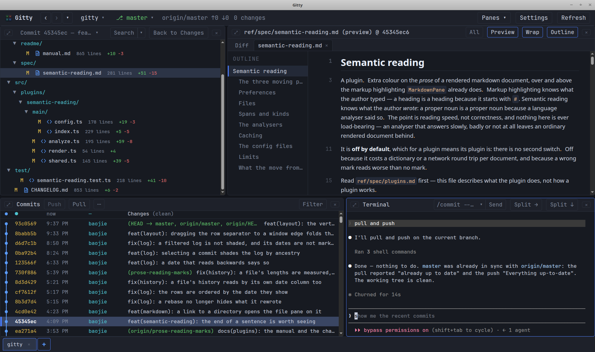

# Gitty

[English](../../README.md) · **简体中文** · [日本語](README.ja.md) · [한국어](README.ko.md) · [Français](README.fr.md) · [Deutsch](README.de.md) · [Español](README.es.md) · [Русский](README.ru.md) · [Português](README.pt.md)

> **翻译于 2026-08-16。**
> [英文 README](../../README.md) 是官方版本，也是唯一持续更新的版本。本文是那一
> 刻的快照，两者不一致时以英文版为准。本文只覆盖这份文件——[手册](manual.zh-CN.md)
> 有自己的翻译，那里同样以英文为官方版本。界面本身全是英文，所以下文中的按钮名、
> 菜单项一律保留原文。

一个桌面端的四窗格 git 历史浏览器，气质接近 `lazygit`，但真正为鼠标而设计：双击
打开文件，右键复制路径，点两个提交就能比较它们。

```
┌──────────────────────┬──────────────────────┐
│ Changes              │ Diff                 │
│ (or a commit's files)│ (unified, coloured)  │
├──────────────────────┼──────────────────────┤
│ Commits              │ Terminal             │
│ (log, ↑↓, Enter)     │ (a real shell)       │
└──────────────────────┴──────────────────────┘
```

所有窗格都能拖动分隔条调整大小，每一个都可以收起再唤回——见
[全屏与隐藏](manual.zh-CN.md#full-screen-and-hiding)。

其他 git 浏览器大多做不到的事：

- **一个真正的 shell 就停靠在历史旁边。** 不是调用 git 的小部件——而是一个以仓库为
  根的真正登录 shell（`$SHELL`），和 diff 在同一个窗口里，可分裂成好几个。多数 git
  浏览器要么没有终端，要么启动外部终端，于是验证一个念头就得来回切窗口。这里它就在
  手边，而且仓库一变，其余每个窗格都会刷新。
- **暂存之后交给 agent，而不是交给一个提交消息框。** 暂存一个文件、一个 hunk，或者
  只是你选中的那几行；然后 **Send** 把你自己的命令——`claude "commit the staged
  changes"`、`codex exec …`，你跑什么就是什么——敲进下方的 shell 并按下回车。写消息
  是 agent 的活。决定*哪些改动算作一个提交*是你的活，那正是这四个窗格的用处。Gitty
  内部不调用任何模型，所以你没有送出去的东西不会离开这台机器。
- **文档，而不只是 diff。** Markdown 会被渲染，HTML 在沙箱 frame 里运行，图片就显示
  成图片——全都在你当前所处的版本上。两年前的 README 会带着*那个*提交随附的截图渲染
  出来，从对象数据库里读出；不涉及磁盘上的任何东西，也不会从网络抓取任何东西。
- **渲染后的 markdown 仍能告诉你在文件里的位置。** 打开 **Markdown source lines**，
  每个标题、段落、列表项、表格、围栏代码块和图片都会在行号槽里标出它在源码里起始的
  那一行——于是你靠阅读找到的一段文字，就能按行号去编辑。
- **diff、blame、文件历史和渲染好的 README 同时打开。** 文件作为自己的标签页开在
  diff *旁边*而不是盖在它上面，每个都记住自己被打开时的版本。读文件绝不会让你丢掉
  正在看的改动。
- **<kbd>Ctrl+F</kbd> 在窗格显示的任何内容里都管用**——包括渲染后的 markdown（搜索读
  的是渲染文本，所以一个短语能跨加粗和代码片段找到），以及 HTML 预览的 frame 内部。
- **历史，端到你的浏览器。** **Open in Browser** 把一次提交——它的元数据、文件、
  diff——交给系统浏览器，由应用内部一个绑定在 `127.0.0.1` 的 web 服务器提供——只有你
  自己的浏览器，没有别人。提交是真实 URL，所以只要仓库开着，历史就能在标签页里读、
  保持打开、用浏览器自带的查找搜索。
- **[gource](https://gource.io/) 就在 commits 菜单里**，装了就可用：仓库的整段历史
  以动画呈现，开在自己的窗口里。gource 不在时那一条不绘制——不会下载或提供任何跑不
  起来的东西。
- **九种界面语言，以及一个明确的时区。** git 给每个提交记录作者的偏移量，所以时间戳
  永远是一个时区选择；在这里你来定，整个 UI——日志、blame、文件历史、"今天"与某个日
  期的分界——都会跟随。



## 为什么又造一个？ <a id="why-another-one"></a>

因为我伸手够到的每个工具都有一处不对：

- **各类 IDE** —— 太重、太慢。（信我，能找到的我都试过。）
- **lazygit、grv** —— 出色的工具，但对鼠标和文本选择不友好。
- **gitui** —— 我想让提交列表和 diff 同时在屏幕上。
- **SmartGit、GitKraken** —— Java，笨重，样式过时，还要收钱。
- **gitg** 之流 —— 同样没有提交列表与 diff 并排。
- **tig** —— 只有 diff，没有文件树可翻。
- **gitk** —— 丑！

还有两件我想要而几乎没人提供的：**Markdown 预览**，以及在窗口任何地方**都能正常
用的复制粘贴**。

## 环境要求 <a id="requirements"></a>

- Node.js 20 或更新版本
- `PATH` 上有 `git`
- Linux、macOS 或 Windows，且有桌面会话
- 可选：[gource](https://gource.io/) 在 `PATH` 上，用于[动画](manual.zh-CN.md#gource)；没有也不
  影响任何功能

## 运行 <a id="running"></a>

### 下载安装包（Linux） <a id="download-a-package-linux"></a>

`.deb` 是上手最快的路——不用装 Node，不用构建：

```bash
wget https://github.com/baojie/gitty/releases/download/v0.2.0/gitty-desktop_0.2.0_amd64.deb
sudo dpkg -i gitty-desktop_0.2.0_amd64.deb
```

它会装上 `/usr/bin/gitty`、一个带图标的应用程序菜单条目，并且带着 Chromium 沙箱
**开启**运行——见[Linux 桌面集成](manual.zh-CN.md#linux-desktop-integration)。

旁边还有 [arm64 的 `.deb`](https://github.com/baojie/gitty/releases/download/v0.2.0/gitty-desktop_0.2.0_arm64.deb)，
以及给没有 dpkg 的发行版用的 AppImage
（[x86_64](https://github.com/baojie/gitty/releases/download/v0.2.0/Gitty-0.2.0-x86_64.AppImage)、
[arm64](https://github.com/baojie/gitty/releases/download/v0.2.0/Gitty-0.2.0-arm64.AppImage)）——
它是第二选择，因为 AppImage 装不了沙箱辅助程序。旧版本都在
[releases 页](https://github.com/baojie/gitty/releases)。

### 从 npm 安装 <a id="from-npm"></a>

```bash
npm install -g gitty-desktop      # installs the gitty command globally
```

### 从源码检出 <a id="from-a-checkout"></a>

把它链接进 PATH：

```bash
./setup.sh               # symlink into ~/.local/bin (no sudo)
./setup.sh --system      # symlink into /usr/local/bin (needs sudo)
```

`setup.sh` 还会装一个可点击的启动器——Linux 上是一个桌面条目，macOS 上是一个极简的
`Gitty.app`。两者都封装同一个 `run.sh`，也都带着未打包 Electron 所需的变通设置；见
[平台说明](manual.zh-CN.md#platform-notes)。

然后在任何地方打开一个仓库：

```bash
gitty                    # open the repository in the current directory
gitty /path/to/repo      # open another repository
gitty --fg               # keep it attached to the terminal (Ctrl+C quits)
gitty --dev              # hot-reloading development mode
gitty --any              # start even outside a work tree (what the desktop
                         # entry uses), falling back to the last repositories
```

Gitty 会从终端脱离并打印自己的 pid，所以 shell 依然可用，关掉它也不会带走窗口。输
出写到 `${XDG_STATE_HOME:-~/.local/state}/gitty/gitty.log`，超过 4 MB 后会被截到
最后 1 MB。

`./run.sh` 是同一个脚本，不做符号链接也一样能用。启动器会在源码有改动时安装依赖并
重建 bundle，所以第一次运行可能要等一会儿。`npm run dev`、`npm run build` 和
`npm start` 也可以直接用。

从不在工作区里的目录启动 Gitty 时，它会回退到上次打开的仓库，而不是只抱怨一句。


## Gitty 不做什么 <a id="what-gitty-does-not-do"></a>

Gitty 读历史，并暂存你决定归到一起的改动。它不 rebase、不 merge、不 cherry-pick、
不解决冲突，也不创建、删除或切换分支——而且也不会去学这些。那些是有状态的、需要多
步的操作，真正有意思的时刻恰恰是出错的时刻；而一个能处理所有这些的 shell 就停靠在
同一个窗口里，并且已经在正确的目录。半个 rebase 按钮比没有更糟。

也没有提交框——这件事比听上去更不值一提。缺的不是提交消息：缺的是一个地方来决定
*哪些改动算一次提交*，而上面说的暂存就是为此而设的。一旦 index 说清了一件事，
**Send** 就把它交给替你写消息的东西。

## 手册 <a id="the-manual"></a>

其余的部分——每个窗格、每项设置、每个快捷键——都在**[手册](manual.zh-CN.md)**：

- [窗口](manual.zh-CN.md#the-window)：标题栏、后退、标签页、最近仓库、全屏与隐藏窗格。
- [各个窗格](manual.zh-CN.md#the-panes)：工作区和暂存、diff、查看文件与渲染文档、
  提交日志和它的连线图、终端。
- [查找文本](manual.zh-CN.md#finding-text)、
  [设置表](manual.zh-CN.md#settings)和
  [键盘快捷键](manual.zh-CN.md#keyboard-shortcuts)。
- [平台说明](manual.zh-CN.md#platform-notes)：Linux 桌面集成和 macOS 应用 bundle。

## 架构 <a id="architecture"></a>

```
src/main       Electron main process — git commands, ptys, fs watchers,
               the recent-repository store, IPC
src/preload    contextBridge API exposed to the renderer as window.gitty
src/renderer   React UI — App.tsx manages tabs, RepoTab.tsx owns one
               repository's four panes
src/shared     Types shared by both sides
build          Application icon (SVG source and rendered PNG)
```

git 通过 `execFile('git', …)` 驱动，解析 `--porcelain=v2 -z` /`--name-status -z`，
所以带空格的路径和重命名都能完好通过。不打包任何 git 库；`PATH` 上的 `git` 是什么，
你看到的就是什么。渲染进程带着 `contextIsolation` 运行，且没有 node 集成。

渲染进程被切成若干按需加载的 chunk，好让窗口在 xterm、highlight.js 和 markdown-it
被解析之前就画出来。这套切分——四个 chunk、把重库挡在热 chunk 之外的规则，以及如何
新增一个——规定在 [ref/spec/lazy-loading.md](../../ref/spec/lazy-loading.md)。


## 许可 <a id="licence"></a>

MIT

