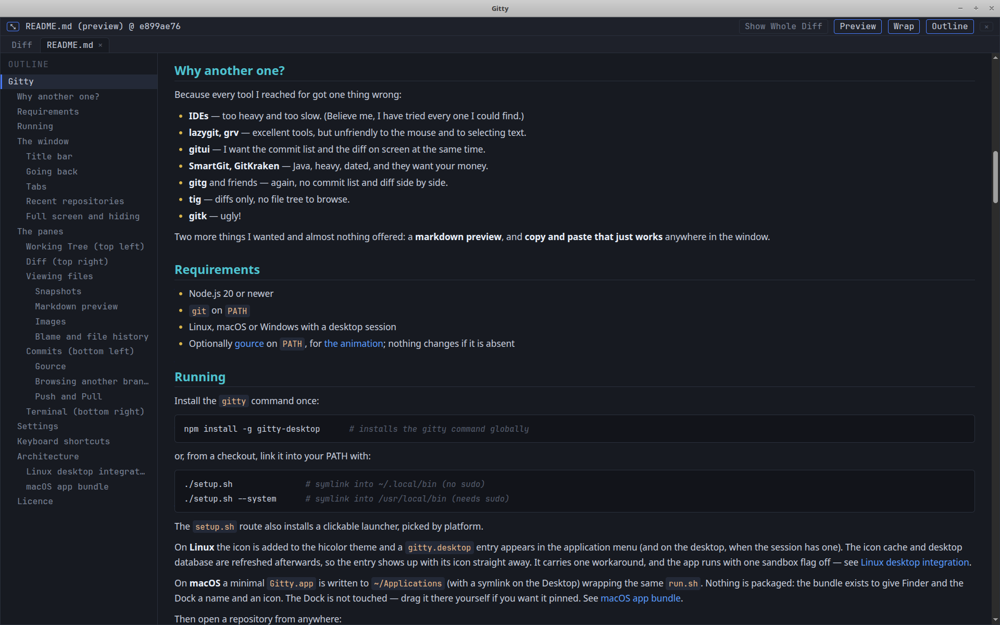
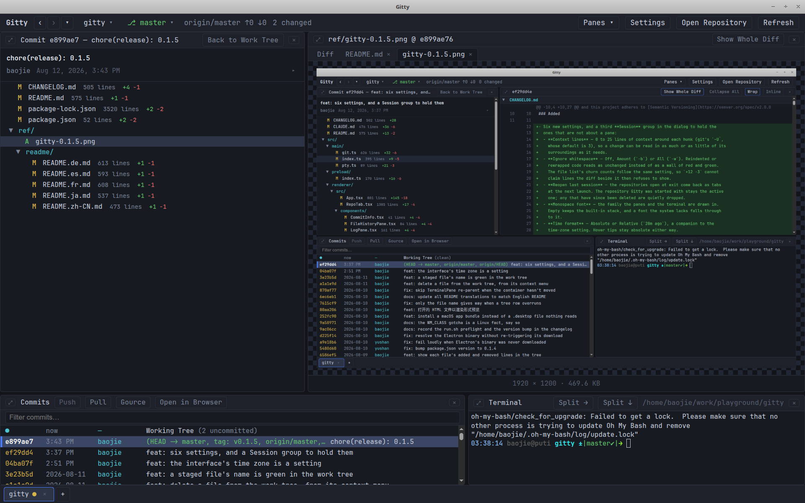
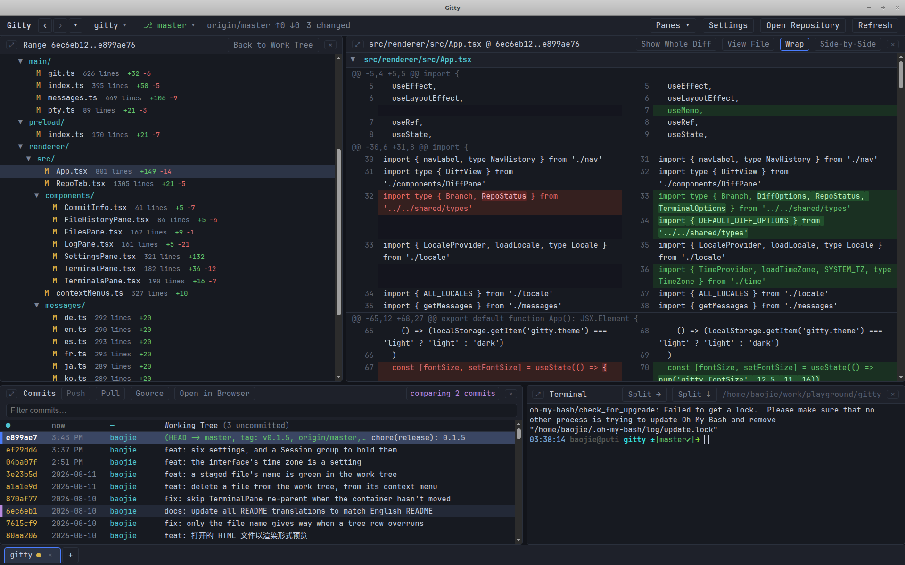

# El manual de Gitty

[English](manual.md) · [简体中文](manual.zh-CN.md) · [日本語](manual.ja.md) · [한국어](manual.ko.md) · [Français](manual.fr.md) · [Deutsch](manual.de.md) · **Español** · [Русский](manual.ru.md) · [Português](manual.pt.md)

Todo lo que hace Gitty, panel por panel. El [README](../../README.md) es la versión
corta — qué es, por qué existe, cómo instalarlo — y sigue siéndolo; aquí viven los
detalles.

> **Traducido el 2026-08-15.**
> El [manual en inglés](manual.md) es la versión oficial y la única que se mantiene
> al día. Este documento es una instantánea de ese momento; donde discrepen, manda
> el inglés. La interfaz está en inglés, así que los nombres de botones y menús se
> dejan tal cual.

---

## La ventana 

Cuatro paneles en el centro, una barra de título encima y una barra de pestañas
debajo.

### Barra de título 

De izquierda a derecha, describe el repositorio activo y luego actúa sobre él:

- **Gitty** — el icono y el nombre en el extremo izquierdo abren el diálogo
  **About**: la versión, la hora de compilación, el autor y las versiones de
  Electron, Chromium y Node, con un enlace a la página de inicio.
- **‹ › ▾** — dónde has estado en este repositorio. Véase
  [Volver atrás](#going-back).
- **La ruta del repositorio** es un botón: abre el menú de
  [repositorios recientes](#recent-repositories).
- **+** junto a él — un selector de directorios, que abre el repositorio que
  elijas en una pestaña nueva (<kbd>Ctrl+O</kbd>). Va junto al botón de
  repositorio porque ambos tratan de lo mismo: qué repositorio estás viendo, y
  abrir otro.
- **⎇ rama** también es un botón — la rama que git tiene en checkout, y un menú
  con todas las demás para leerlas. Véase
  [explorar otra rama](#browsing-another-branch).
- **`origin/main ↑2 ↓0`** — el upstream de la rama actual y cuánto se adelanta o
  se retrasa. Ausente en una rama que no sigue a ninguna.
- **`3 changed`** — cuántos archivos tiene el árbol de trabajo sin confirmar, el
  mismo recuento que lleva la fila **Working Tree** del panel de commits.
- **Panes ▾** — mostrar u ocultar cada uno de los cuatro; véase
  [Pantalla completa y ocultar](#full-screen-and-hiding).
- **Settings** — el diálogo de preferencias ([Ajustes](#settings)), también con
  <kbd>Ctrl+,</kbd>.
- **Refresh** — releer el estado y el log a mano (<kbd>F5</kbd> /
  <kbd>Ctrl+R</kbd>). Gitty vigila el repositorio y se refresca solo; esto es
  para las veces en que la vigilancia no ve un cambio.

Mientras lees otra rama el botón de rama muestra `⎇ main › other-branch`, y los
errores del último comando de git aparecen en rojo junto a los recuentos.

### Volver atrás 

Leer historial significa deambular: un commit, un archivo dentro de él, otro
commit dos páginas más abajo en el log, y luego volver al primero. Los tres
botones a la izquierda de la barra de título recuerdan ese deambular, como lo
hace un navegador.

- **‹** (<kbd>Alt+←</kbd>) vuelve al lugar que estabas mirando antes de este, y
  **›** (<kbd>Alt+→</kbd>) regresa al que dejaste atrás. Ambos se atenúan cuando
  no hay adónde ir, y al pasar el ratón por cualquiera de ellos se nombra el
  lugar al que te llevaría.
- **▾** lista los lugares en sí, el más reciente primero, con un punto en el que
  estás. Elige cualquiera para saltar directamente allí.

Un *lugar* es todo lo que los dos paneles superiores estaban mostrando: la vista
— el árbol de trabajo, un commit, un rango de dos, una instantánea — el archivo
seleccionado dentro de ella, y el documento abierto junto al diff. Así que una
parada se lee como `Working tree`, `7bb7787 — Refresh screenshot batches`,
`src/main/git.ts @ 7bb7787` o `blame: src/main/git.ts @ 7bb7787`, y volver a
ella devuelve el mismo archivo a pantalla en la misma revisión en vez de
simplemente volver a seleccionar el commit.

El historial pertenece al repositorio, no a la ventana: cada pestaña recuerda sus
propios cincuenta lugares más recientes, y cambiar de pestaña cambia por cuáles
caminan los botones. No se conserva entre reinicios.

### Pestañas 

Una barra de pestañas en la parte inferior contiene cada repositorio abierto — su
nombre base, un punto amarillo cuando el árbol de trabajo tiene cambios sin
confirmar, y una **×** para cerrarlo. El punto cuenta todo lo que reporta
`git status`, archivos sin seguimiento incluidos, y se gana su sitio en las
pestañas que *no* estás mirando: el repositorio activo ya dice `3 changed` en la
barra de título, mientras que una pestaña de fondo está oculta por completo, así
que el punto es la única señal de que allí queda trabajo. Al pasar el ratón por
una pestaña se nombra el repositorio y se dice con palabras.

**+** (y <kbd>Ctrl+O</kbd>) abre otro repositorio en una pestaña nueva; la barra
de título siempre muestra el activo. Cada pestaña conserva sus propios paneles y
su terminal, así que el commit que estás leyendo y la shell que dejaste corriendo
siguen exactamente donde estaban cuando te vas y vuelves. Cerrar la última
pestaña deja una ventana vacía con un botón para abrir el siguiente repositorio.
(Las pestañas abiertas no se recuerdan entre reinicios.)

### Repositorios recientes 

La ruta del repositorio en la barra de título es un menú de los repositorios
abiertos antes — nombre base más su directorio padre — el más reciente primero.

- **Clic** — abrirlo en una pestaña nueva.
- **Ctrl/Cmd+clic** o **clic central** — abrirlo en la pestaña actual,
  reemplazando el repositorio que hubiera allí y conservando el sitio de la
  pestaña en la barra.
- **Clic derecho** — quitar la entrada de la lista. El menú sigue abierto, así
  que se pueden limpiar varias seguidas.

**Open Repository…** y **Clear Recent** están debajo. La lista vive en
`~/.config/Gitty/recent-repos.json`, guarda doce entradas y omite las que se
hayan movido o borrado.

### Pantalla completa y ocultar 

La cabecera de cada panel lleva los mismos dos controles: **⤢** a su izquierda
llena la ventana con ese panel, y **×** a su derecha lo oculta.

La pantalla completa cubre todo lo demás, incluidas las barras de título y de
pestañas, y los paneles de debajo siguen funcionando — la terminal continúa
ejecutándose mientras está tapada. **⤡** en la misma esquina, <kbd>Esc</kbd>, un
doble clic en la cabecera, o <kbd>Ctrl+Shift+1</kbd> … <kbd>Ctrl+Shift+4</kbd>
restauran la disposición. Solo un panel está a pantalla completa a la vez.

Ocultar es la otra dirección — cualquier panel puede guardarse y recuperarse:

- **Panes** en la barra de título lista los cuatro, con un punto junto a los
  visibles; al pulsar uno se alterna, y **Show All Panes** restaura la
  disposición de cuatro paneles.
- <kbd>Ctrl+1</kbd> … <kbd>Ctrl+4</kbd> alternan Files, Diff, Commits y Terminal,
  en ese orden.
- <kbd>Ctrl+Shift+0</kbd> recupera los cuatro — cero por «todos», una tecla más
  allá de las cuatro que alternan cada uno. Lleva Shift porque
  <kbd>Ctrl+0</kbd> es el restablecer-zoom del motor del navegador, que el menú
  View conserva.

Lo que queda se reparte la ventana, así que ocultar el panel de commits le da al
diff toda la altura. El último panel visible no tiene **×** — una ventana vacía
no dejaría nada donde hacer clic. Los paneles ocultos se recuerdan entre
reinicios, y el panel de la terminal solo se guarda, nunca se cierra: sus shells
siguen corriendo y vuelven con su historial de desplazamiento intacto.

## Los paneles 

### Working Tree (arriba a la izquierda) 

Los archivos modificados como un árbol plegable, cada uno con su número de líneas
junto al nombre. Explorar un repositorio entero — el árbol de trabajo o la
instantánea de un commit — abre con todos los directorios cerrados, puesto que es
un árbol en el que descender y no una lista de cambios que leer; una lista de
cambios se abre desplegada. Los directorios van antes que los archivos en todos
los niveles, y dentro de cada grupo los nombres se ordenan como espera un lector
y no como lo haría una comparación de bytes: los dígitos de un nombre cuentan
como número, de modo que `W9` va antes que `W10`, y las mayúsculas no son una
diferencia de primer orden, de modo que `butler/` se ordena con las bes en vez de
después de cada letra mayúscula. Se muestran dos columnas de estado: el del área
de preparación (verde) y el del árbol de trabajo (amarillo / rojo); los archivos
sin seguimiento son `??`. El recuento se lee del disco en el árbol de trabajo y de
la revisión en los demás casos; los archivos binarios, los borrados y los de más
de 8 MB sencillamente no muestran ninguno. Después va la rotación — cuántas líneas
añadió y quitó este cambio en ese archivo, `+12 −3`, contra HEAD en el árbol de
trabajo y contra el padre para un commit o un rango. Una instantánea es un árbol y
no un cambio, así que no tiene rotación; tampoco los archivos binarios ni un merge
commit, cuyo diff combinado no atribuye nada.

- **Clic** — mostrar el diff del archivo a la derecha.
- **Doble clic** — abrir el archivo entero como documento junto al diff, con
  números de línea y resaltado de sintaxis (un documento representado para
  markdown, la propia imagen para una imagen).
- **Clic en una columna de estado** — preparar el archivo, o deshacer su
  preparación si ya estaba preparado.
- **Clic derecho** — View File, Open in System App, Reveal in File Manager, Copy
  Relative Path, Copy Absolute Path, Copy File Name, Blame File, File History,
  Stage / Unstage File, Discard Changes, Delete File.
- **Clic en una carpeta** — plegarla o desplegarla.

**Discard Changes** devuelve el archivo a lo que guarda el índice, tras una
confirmación nativa que dice claramente que no hay vuelta atrás; un archivo sin
seguimiento no tiene versión en el índice a la que volver, así que en su lugar
ofrece **Delete File**, que va a la papelera del sistema.

**Send to agent** en la cabecera entrega el índice. Escribe un comando en la shell
del panel inferior derecho y pulsa Enter, y eso es todo: no se llama a ningún
modelo desde Gitty, no sale de la máquina nada que no hayas enviado. Las peticiones
y la salida del agente aparecen en la terminal, donde hay un tty de verdad, así que
los hooks y la firma gpg funcionan como siempre.

La flecha junto al botón es donde se elige el comando — no hay ajuste para ello,
porque es una pregunta que se hace una vez por entrega y no una vez por
instalación. El menú lista los comandos que Gitty recuerda, marca el que el propio
botón ejecuta y ejecuta el que elijas. La **×** a la derecha de una entrada la
saca de la lista, tras una confirmación — la lista es el único sitio donde se
anota un comando, y el menú sigue abierto para poder quitar varios seguidos.
**New command…** abajo abre una caja de una línea, prerrellenada con el comando
actual, para lo que no esté en la lista. La lista empieza con unas cuantas
sugerencias — qué agente está instalado no es algo que Gitty pueda saber — y un
comando entra en ella por haber sido ejecutado, así que nada se recuerda por la
fuerza de una línea a medio escribir.

El clic derecho sobre la fila del árbol de trabajo en el log de commits ofrece
también **Copy Staged Diff**, para una conversación que ocurre en otra ventana.

Cuando hay un commit o un rango seleccionado, este panel lista los archivos de
ese commit; **Back to Work Tree** (o <kbd>Esc</kbd>) vuelve al árbol de trabajo.
En una [instantánea](#snapshots) lista el árbol entero en ese commit, no solo lo
que cambió.

### Diff (arriba a la derecha) 

Diff unificado con números de línea antiguos y nuevos, cabeceras de hunk y color
de añadido/borrado, dispuesto como una lista de archivos: cada ruta es un título
a todo lo ancho, la cabecera de hunk está atenuada — es un rango de líneas, no lo
primero que hay que mirar — y un renombrado se lee `old → new`. Sin archivo
seleccionado lo muestra todo a la vez: cada cambio sin confirmar del árbol de
trabajo, o cada archivo del commit seleccionado.

- **Show Whole Diff** — volver a ese diff combinado tras elegir un archivo. Se
  queda en la cabecera y se ilumina mientras el diff completo es lo que estás
  viendo. La versión del árbol de trabajo cubre a la vez los cambios preparados y
  sin preparar, e inserta los archivos sin seguimiento (hasta 50, luego un
  aviso), que `git diff` por sí solo deja fuera.
- **Wrap** — ajustar las líneas largas en vez de desplazarse en horizontal.
  Activado por defecto.
- **Inline / Side-by-Side** — una columna con marcas `+`/`-`, o antiguo y nuevo
  uno al lado del otro, donde una tirada de borrados se empareja con los añadidos
  que la siguen. Las mitades ajustadas siguen alineadas.
- **Títulos de archivo** — cada título pliega su archivo: el triángulo lo reduce
  al nombre, y **Collapse All** / **Expand All** en la cabecera lo hacen con
  todos. **Ctrl+clic** en un título abre ese archivo en una pestaña de documento
  nueva; con clic derecho salen **Open in a New Tab**, **Select in the File
  List**, las copias de ruta y — en el árbol de trabajo, donde el archivo del
  disco es la versión mostrada — **Open in System App** y **Reveal in File
  Manager**. Un renombrado abre su ruta nueva.
- **Stage / Unstage** — mientras el diff sea el trabajo de un archivo con
  seguimiento, cada cabecera de hunk lleva un botón que mete ese hunk en el índice
  o lo saca. Selecciona primero líneas y el botón se vuelve **Stage 3 lines**: un
  añadido sin seleccionar queda fuera del patch, una supresión sin seleccionar se
  degrada a línea de contexto, y la cabecera del hunk se recalcula — la misma
  división que hace `git add -p`, desde una ventana donde tienes el archivo entero
  delante. La selección es la selección de texto normal, así que arrastrar sigue
  copiando. Una selección que abarca dos hunks le da a cada uno su parte.
- **Unstaged / Staged** — de qué lado del índice se lee un archivo, mostrado una
  vez que ambos lados guardan algo. Preparar actúa sobre el que esté en pantalla.
  Los archivos binarios, los cambios de modo y los renombrados no tienen hunks que
  elegir y se preparan enteros desde la lista de archivos; los botones de hunk
  también desaparecen mientras **Ignore whitespace** está activo, porque ese diff
  no guarda cada cambio que aplicaría.
- **Clic derecho** — Copy Selection, Copy Whole Diff y los mismos interruptores.

Las palabras que cambian dentro de una línea modificada se resaltan cuando eso se
lee mejor que la línea entera; es **Word highlight** en [Ajustes](#settings).

Los ajustes se recuerdan entre ejecuciones. Las filas se representan en bloques
de 1500 y se extienden al desplazarse, así que los commits grandes siguen ágiles;
los diffs de más de 2 MB se truncan con un aviso.

### Ver archivos enteros 

Por defecto el panel muestra un diff, pero cualquier archivo puede abrirse
entero: **doble clic** en el árbol, **View File** / **Preview** en la cabecera,
**Ctrl+clic** en un título de archivo dentro del diff, o desde cualquiera de los
dos menús contextuales.

El archivo se abre como documento propio en una tira de pestañas *junto* al diff,
en vez de encima, así que se puede leer sin perder el diff en el que estabas. La
pestaña **Diff** siempre va primera y un solo clic en el árbol sigue navegando
diffs en el sitio. Cada documento recuerda la revisión en la que se abrió, se
cierra con su propia **×** y relee un archivo del árbol de trabajo cuando el
repositorio cambia. Los archivos de código llevan números de línea y resaltado de
sintaxis; markdown se abre [representado](#markdown-preview), con un interruptor
para volver a la fuente; HTML se abre [representado también](#html-preview); una
imagen se abre como [la imagen](#images).

Qué revisión obtienes sigue al panel: el archivo del disco en el árbol de
trabajo, el archivo tal como estaba en el commit seleccionado en los demás casos.
Abrir un documento es una acción y no un modo — seleccionar otro archivo u otro
commit devuelve el diff — así que el panel nunca se queda atascado mostrando
archivos cuando querías cambios.

#### Instantáneas 

Haz clic derecho en un commit y elige **Browse Snapshot** para leer el
repositorio tal como estaba en él: el panel superior izquierdo lista el árbol
*entero* en vez de los archivos que ese commit tocó, y cualquier archivo se abre
en esa revisión. Una instantánea no tiene diff que mostrar, así que allí todos
los archivos son documentos.

Los archivos de una instantánea nunca existieron en el disco en esa revisión, y
por eso **Open in System App** entrega una copia temporal y **Reveal in File
Manager** ni se ofrece. **Back to Work Tree** (o <kbd>Esc</kbd>) sale.

#### Vista previa de Markdown 

Seleccionar un archivo `.md` añade un botón **Preview** — apagado por defecto,
así que un diff sigue siendo un diff hasta que pidas el documento representado.
Representa el archivo entero: la versión del disco en el árbol de trabajo, la
versión del commit seleccionado en los demás casos.

Los bloques de código delimitados se resaltan cuando nombran un lenguaje, el
front matter YAML se extrae y se muestra como su propio bloque resaltado, y los
niveles de encabezado, las marcas de lista, los enlaces y el código en línea
llevan color para que la estructura se lea de un vistazo.

- **Wrap** — el mismo interruptor que el del diff, activado por defecto. La prosa
  siempre se ajusta; en una vista previa esto decide si los bloques de código, las
  tablas anchas y las cadenas largas en línea se ajustan también, en vez de
  desplazarse en horizontal.
- **Outline** — la estructura de encabezados junto al documento, sangrada por
  nivel, siguiendo el encabezado hasta el que has bajado. Haz clic en una entrada
  para saltar, y arrastra el separador entre ella y el documento para darle más
  espacio a cualquiera de los dos lados. La anchura es compartida por todos los
  documentos del repositorio — es una preferencia de lectura, no una propiedad de
  un archivo — y dura tanto como la ventana, como los tamaños de los demás
  paneles.
- **Source lines** — apagado por defecto, y se activa en
  [Ajustes](#settings): cada encabezado, párrafo, elemento de lista, tabla,
  bloque delimitado e imagen se numera en el margen izquierdo con la línea en la
  que empieza en la fuente. Los números se dibujan en vez de insertarse, así que
  se quedan fuera de la selección que copias y de lo que busca <kbd>Ctrl+F</kbd>.
  Una imagen escrita dentro de una frase toma la línea de su párrafo, al no tener
  una propia.
- **<kbd>Ctrl+F</kbd>** — buscar en el documento; véase
  [Buscar texto](#finding-text).
- **Clic derecho** — Copy Selection, Copy Markdown Source, los interruptores de
  ajuste y esquema, y Show Diff Instead.

El HTML crudo dentro del markdown no se representa, y un enlace a la web se abre
en el navegador del sistema y no dentro de la aplicación. Un enlace a otro archivo
del repositorio — `ref/readme/manual.md`, `../README.md`, `/CHANGELOG.md` — se
sigue aquí en cambio: **Ctrl/Cmd+clic** abre ese archivo como su propio documento
junto al diff, en la misma revisión que el documento que lleva el enlace, así que
un README leído en un commit antiguo lleva a los archivos de ese commit. Un
`#fragment` al final viaja con él — `manual.md#the-window` abre el manual en ese
encabezado, como lo haría en una forja — y un encabezado que este documento no
tiene simplemente lo abre arriba. Pasar el ratón por un enlace así lo dice. Un
clic simple no hace nada, como antes, y un enlace que trepa más allá de la raíz
del repositorio no es uno de estos. Las imágenes escritas con ruta relativa al
documento se leen del repositorio — en la misma revisión que el documento, así que
un commit antiguo muestra las capturas con las que se publicó. Una que el
repositorio no tenga ahí deja un marcador de posición punteado con su texto
alternativo. Las imágenes de la web no se descargan en absoluto: leer el README de
un desconocido no debería anunciarte al servidor al que apunte.

#### Vista previa de HTML 

Un archivo `.html`, `.htm` o `.xhtml` recibe el mismo botón **Preview**, y el
documento se representa en vez de mostrarse como fuente — la versión del disco en
el árbol de trabajo, la versión del commit seleccionado en los demás casos.

Se representa en un marco aislado cargado mediante `srcdoc`, así que la página
nunca puede sacar a la aplicación de sí misma. Se aplican sus propias hojas de
estilo — maquetación, colores, fuentes son del documento. Los scripts no se
ejecutan y las imágenes remotas no se descargan: el marco hereda la política de
seguridad de contenido de la aplicación, que no admite ni una cosa ni la otra.
Una página se muestra, no se ejecuta. **Wrap** decide si el marco se desplaza por
sí solo o crece hasta su contenido para que la página entera se desplace como
una. <kbd>Ctrl+F</kbd> y <kbd>Ctrl+Shift+C</kbd> funcionan dentro del marco,
cuyas teclas nunca llegan al resto de la ventana.

#### Imágenes 

Un `.png`, `.jpg`, `.gif`, `.webp`, `.bmp`, `.ico`, `.avif` o `.svg` se abre como
la imagen y no como un aviso de que es binario — del disco en el árbol de
trabajo, del commit en los demás casos. Se ajusta al panel sobre un tablero de
ajedrez, para que la transparencia se lea como transparencia; **haz clic** para
verla a tamaño real y desplazarte, y otra vez para ajustarla. Sus dimensiones en
píxeles y su tamaño en disco van debajo. Las imágenes de más de 12 MB no se
insertan.

#### Blame e historial de archivo 

Haz clic derecho en cualquier archivo del árbol y elige **Blame File** o **File
History**; ambos se abren como documentos junto al diff. Blame muestra una fila
por línea de código fuente — el commit, su autor, su fecha y la línea en sí,
resaltada como el visor de código, con un guion largo donde una línea aún no está
confirmada — en la revisión que estás viendo. File History lista cada commit que
tocó el archivo, sigue los renombrados, y al hacer clic en un commit lo abre.

El clic derecho sobre una fila de blame ofrece **History of These Lines**:
`git log -L` sobre las líneas que cubre la selección — o la línea pulsada, sin
selección — que se abre como su propio documento mostrando cada commit que las tocó
junto con lo que les hizo. Blame responde *quién fue el último*; esto responde
*cómo llegó a ser así*. Sigue el rango a través de los renombrados por sí mismo.

#### Buscar en el repositorio 

**Search** en la cabecera del panel del árbol de trabajo abre una caja encima de la
lista de archivos y ejecuta `git grep`. Los resultados son un documento agrupado
por archivo, con los números de línea a la izquierda; al hacer clic en uno se abre
ese archivo en esa línea, con la línea marcada.

La búsqueda sigue la revisión en pantalla: en el árbol de trabajo lee lo que hay en
el disco, trabajo sin confirmar incluido, y en un commit o una instantánea lee esa
revisión — la caja dice cuál. Por encima de 2000 resultados se detiene y lo dice,
como hace un diff demasiado grande. El patrón llega a git como un solo argumento,
así que una expresión regular no se deshace por el camino.

### Commits (abajo a la izquierda) 

El log de la rama actual, cargado de 300 en 300 y ampliado al desplazarse. La
primera fila es **Working Tree** — los cambios sin confirmar, con un recuento de
archivos modificados; seleccionarla devuelve los paneles superiores al árbol de
trabajo. Una caja de filtro encima del log reduce la lista — con espera, y una ✕
para limpiar — y el resultado pagina de la misma manera.

**Graph** en la cabecera dibuja los carriles junto a los hashes: dónde se separó
una rama, dónde aterrizó un merge, a qué línea pertenece un commit. Se calcula a
partir de los padres de cada commit en vez de analizarse desde `git log --graph`,
cuyo ASCII está compuesto para una terminal. Un carril conserva su color página
abajo, y la paleta es fija — deliberadamente a diferencia del blame, cuyos colores
derivan del SHA y significan «quién». Pasados los diez carriles, el desborde
comparte la última columna, anillada, de modo que un repositorio con muchas
cabezas no puede empujar los asuntos fuera del panel. **All Branches** muestra
todas las ramas a la vez (`git log --all`), que es como dos ramas pueden verse en
relación la una con la otra; el menú de rama sigue leyendo una a la vez.

El menú desplegable de al lado dice qué se está buscando:

| | |
| --- | --- |
| **Message / Author** | El mensaje del commit y el autor, sin distinguir mayúsculas. El predeterminado. |
| **Content** | el `-S` de git: los commits donde el *número de apariciones* del texto cambió — donde se introdujo o se eliminó. Literal, de modo que una búsqueda llena de `.` y `(` significa esos caracteres. |
| **Content regex** | el `-G` de git: cada commit cuyo diff coincide con la expresión, incluidos los que solo movieron la línea. |

Los dos modos de contenido responden a la pregunta que el blame no puede — *qué
commit introdujo esta línea* — y para ello leen cada diff del historial, así que
la caja dice que está buscando mientras corren. Cambiar el texto o el modo mata la
búsqueda en curso; no se empalma nada en una línea de comandos, así que una
expresión regular llega a git como un solo argumento.

- **Clic** o <kbd>Enter</kbd> — mostrar ese commit: sus archivos llenan el panel
  superior izquierdo y su diff completo el superior derecho. El asunto, autor,
  fecha y cuerpo completo del commit aparecen en una franja encima de la lista de
  archivos; cuando el cuerpo es largo, un interruptor ▸ lo pliega para que la
  lista de archivos conserve el espacio.
- **Ctrl+clic** (<kbd>Cmd</kbd> en macOS), <kbd>Shift+clic</kbd> o
  <kbd>Space</kbd> — elegir un segundo commit y comparar los dos, el más antiguo
  primero.
- **↑ ↓ / j k / PgUp / PgDn / Home / End** — mover el cursor.
- **Clic derecho** — mostrar el diff, copiar el hash, el hash corto o el asunto,
  [explorar la instantánea](#snapshots), o comparar con el commit seleccionado.
- **Clic derecho → Open in Browser** — representar este commit en el navegador
  del sistema; **Copy Commit URL** copia el enlace. Un servidor web dentro de la
  aplicación sirve cada repositorio abierto como una lista de commits navegable —
  el botón **Open in Browser** del panel de commits aterriza ahí — con los
  metadatos, archivos y diff de cada commit, y los diffs por archivo a un clic.

  Escucha en `127.0.0.1`, y eso solo no sería gran cosa: la vuelta local mantiene
  fuera a otras máquinas, no a otras páginas de tu propio navegador, cualquiera de
  las cuales podría recuperarlo. Así que cada URL lleva un token generado al
  arrancar y guardado en memoria — `/t/<token>/…` — que los enlaces que Gitty te
  entrega ya tienen. Un token equivocado es un 404 y no un 403, una petición cuyo
  `Host` no sea la vuelta local se rechaza (eso es lo que vuelve inútil el
  reenlace de DNS), y las páginas se sirven con `Referrer-Policy: no-referrer`,
  de modo que seguir un enlace fuera de un mensaje de commit no se lleva el token.
  El token es nuevo en cada lanzamiento, así que las URLs funcionan mientras corre
  esta sesión.
- Seleccionar un archivo en el panel superior izquierdo estrecha el diff a ese
  archivo; **Show Whole Diff** lo vuelve a ensanchar.

#### Gource 

Si [gource](https://gource.io/) está en el `PATH`, el panel de commits muestra un
botón **Gource** junto a **Open in Browser**: reproduce el historial del
repositorio como una animación — el árbol de directorios creciendo, los archivos
iluminándose al aterrizar cada commit, un autor volando entre ellos por cada
nombre en el log. Gource abre su propia ventana y sigue ejecutándose después de
cerrar Gitty; el botón solo espera lo suficiente para ver que arrancó, y muestra
lo que gource dijo si no lo hizo.

Se inicia con un día de historial por cada medio segundo, los archivos inactivos
se mantienen en pantalla y los huecos largos se saltan, que es lo que hace que un
repositorio real sea legible en vez de un goteo lento. No se instala nada por ti:
donde gource no está en el `PATH`, el botón simplemente no aparece.

#### Explorar otra rama 

La rama de la barra de título abre un menú con todas las ramas locales y de
seguimiento remoto, la del commit más nuevo primero, y al elegir una se muestra
el historial de esa rama. Es una mirada de solo lectura: gitty no ejecuta ningún
`checkout`, así que el árbol de trabajo, sus diffs y las terminales se quedan
exactamente donde git los dejó. Mientras miras otra rama la barra de título dice
`⎇ main › other-branch` y el panel de commits indica qué rama está listando;
**Back to \<branch\>** vuelve. Cada pestaña explora por su cuenta.

#### Push y Pull 

**Push** y **Pull** están en la cabecera, y ambos actúan sobre la rama en
checkout, apunte el log a la rama que apunte. **Push** cuenta lo que falta por
enviar — **Push 3** — y se apaga cuando no hay nada; en una rama que no sigue a
ninguna, publica la rama en `origin` y fija el upstream. **Pull** avanza en fast
forward desde el upstream, y se apaga cuando no hay upstream del que tirar. Lo
que diga git aparece sobre el log — clic para descartarlo; los fallos se quedan
hasta que lo hagas.

Ninguno puede responder a una petición: no hay terminal detrás, así que un push
que quiere una contraseña o una frase de paso falla con el mensaje de git en vez
de quedarse colgado, y un pull que no puede avanzar lo dice. Ambos se rematan
luego a mano en el panel de la terminal, que está justo ahí.

### Terminal (abajo a la derecha) 

Una shell de inicio de sesión interactiva de verdad (`$SHELL`) con raíz en el
repositorio, así que cualquier comando de git se ejecuta directamente.
<kbd>Ctrl+Shift+C</kbd> copia la selección de la terminal — <kbd>Ctrl+C</kbd>
allí es la interrupción, y sigue siendo la interrupción. El mismo acorde copia
también en todos los demás paneles, así que no cambia de significado al moverse
el foco. Los demás paneles se refrescan automáticamente cuando el repositorio
cambia en el disco. Qué shell inicia, y si inicia como shell de inicio de sesión,
son [Ajustes](#settings); ambas se leen cuando se crea una terminal, así que un
cambio surte efecto en la siguiente división.

El panel se divide en tantas shells como quieras: **Split →** pone una nueva al
lado de la terminal enfocada, **Split ↓** debajo, y los separadores entre ellas
se arrastran como los de cualquier otro panel. Al hacer clic en una terminal se
enfoca — la del contorno es donde aterrizan la siguiente división o **Close**.
Dividir dos veces en la misma dirección alarga la fila o la columna en vez de
anidar, así que tres terminales en paralelo se redimensionan entre sí.

**Close** termina la shell enfocada; salir de una shell con `exit` cierra su
división por sí solo. La última terminal siempre se queda: salir de ella deja el
aviso en pantalla en vez de un panel vacío.

## Buscar texto 

<kbd>Ctrl+F</kbd> busca lo que sea que muestre el panel de la derecha: un diff, un
archivo, un documento markdown representado, una [vista previa de
HTML](#html-preview), un blame o el historial de un archivo. Cada coincidencia se
resalta con la actual destacada, <kbd>Enter</kbd> y <kbd>Shift+Enter</kbd> (o las
flechas) las recorren y dan la vuelta en ambos extremos, el recuento dice dónde
estás, y <kbd>Esc</kbd> cierra.

La búsqueda no distingue mayúsculas y lee el texto como se representa, no el
marcado que hay detrás — así una frase se encuentra a través de los tramos en
negrita y de código que markdown deja dentro, y un diff se busca como las líneas
que ves. Las vistas que se representan en bloques al desplazarte (un archivo
largo, un diff grande) representan el resto cuando se abre la franja, así que el
recuento cubre el todo y no la parte a la que has bajado hasta ahora. Un archivo
plegado en un diff de varios archivos sigue plegado y no se busca.

## Ajustes 

**Settings** en la barra de título, o <kbd>Ctrl+,</kbd>. Todo lo de aquí se
aplica a todas las pestañas y se recuerda entre reinicios; **Restore Defaults** lo
devuelve todo a su sitio. El diálogo está en tres pestañas — **Appearance**,
**View** y **Session** — así que cabe en una pantalla a medida que crece; la tabla
de abajo las lista en ese orden.

| | |
| --- | --- |
| **Theme** | Dark o Light. |
| **Language** | English, 简体中文, 日本語, 한국어, Français, Deutsch, Español, Русский o Português — la interfaz, los menús y los diálogos cambian todos a la vez sin reiniciar. |
| **Time zone** | La zona en la que se representa cada fecha y hora en pantalla: la de la máquina por defecto, o UTC, o cualquier zona que el sistema conozca. Git registra cada commit con el desfase de su autor, así que una marca de tiempo es siempre una elección de zona — aquí es donde se hace. La columna de fechas del log la sigue, lo que significa que la frontera entre «hoy» y una fecha se mueve con ella. |
| **Time format** | Absoluto (una hora de reloj o una fecha) o Relativo (`28m ago`, `2h ago`). El relativo esquiva del todo la cuestión de la zona; la pista al pasar el ratón por una fila sigue siendo absoluta en cualquier caso, y nombra su zona. |
| **Font size** | 9 – 20, en medios puntos. Se aplica a todos los paneles, la terminal incluida. |
| **Monospace font** | La familia con la que se dibujan los paneles y la terminal, elegida entre las fuentes monoespaciadas encontradas en esta máquina. **System default** es la pila integrada (JetBrains Mono, Fira Code, DejaVu Sans Mono, …). |
| **Row height** | 18 – 26 píxeles — la altura de línea sobre la que se construye cada lista: el árbol de archivos, el log y el diff. Más apretado cabe más en pantalla, más suelto se lee mejor. |
| **Diff layout** | Inline o Side-by-Side, el mismo interruptor que lleva la cabecera del diff. |
| **Context lines** | 0 – 25 líneas sin cambios alrededor de cada hunk — el `-U` de git, cuyo propio valor por defecto es 3. Ensánchalo para ver en qué está asentado un cambio, estréchalo para que quepa más de un diff grande en pantalla. |
| **Ignore whitespace** | Off, Amount (el `-b` de git: una tirada de espacios que cambia de longitud no es un cambio) o All (`-w`: ninguna diferencia de espacios lo es). El código reindentado o reaparejado se lee como sin cambios en vez de como un muro de rojo y verde. Los recuentos `+12 −3` de la lista de archivos siguen el mismo ajuste, así que no puede reclamar líneas que luego el diff se niega a mostrar. |
| **Word wrap** | Ajustar las líneas largas en vez de desplazarse en horizontal. |
| **Word highlight** | Marcar las palabras que cambiaron dentro de una línea modificada, no solo la línea. |
| **Markdown outline** | Mostrar el esquema junto a un documento representado. |
| **Markdown source lines** | Numerar cada bloque de un documento representado con la línea en la que empieza en la fuente. Encabezados, párrafos, elementos de lista, tablas, código delimitado e imágenes llevan uno cada uno, en un margen a la izquierda. Apagado por defecto. |
| **File sorting** | Orden Natural o Byte. El natural lee los dígitos de un nombre como número (`W9` antes que `W10`) y pone las mayúsculas en segundo lugar; el orden byte es el de git, donde cada mayúscula va por delante de cada minúscula. |
| **Reopen last session** | Reabrir los repositorios que estaban abiertos cuando la aplicación salió por última vez. El repositorio con el que arrancó Gitty sigue siendo la pestaña activa; los que desde entonces se hayan borrado se descartan en silencio. |
| **Shell** | La shell con la que arranca una terminal, listada desde `/etc/shells` más las rutas habituales (`COMSPEC` y PowerShell en Windows). **System default** es `$SHELL`. Una ruta que desde entonces haya desaparecido recae en ella en vez de dejar un panel muerto. |
| **Login shell** | Arrancarla con `-l`, para que se cargue el perfil del usuario. Apágalo para una shell más rápida y silenciosa — sin salida de perfil, sin comprobaciones de inicio de sesión. Las shells de Windows no tienen tal bandera y lo ignoran. |

**Shell** y **Login shell** se leen cuando se crea una terminal, así que surten
efecto en la siguiente división o la siguiente pestaña de repositorio, no en las
shells ya en marcha. **Word wrap**, **Diff layout** y **Markdown outline** son los
mismos interruptores que lleva la cabecera del diff, así que cambiar uno en
cualquiera de los dos sitios cambia ambos. **Word highlight** solo vive aquí.

## Atajos de teclado 

| Tecla | Acción |
| --- | --- |
| <kbd>Enter</kbd> | Mostrar el commit seleccionado |
| <kbd>Space</kbd> / <kbd>Ctrl+Click</kbd> | Marcar un segundo commit y comparar el par |
| <kbd>Ctrl+Click</kbd> en un título de archivo | Abrir ese archivo en una pestaña de documento nueva |
| <kbd>Ctrl+F</kbd> | Buscar en el diff, el archivo o lo que sea que muestre el panel |
| <kbd>Ctrl+C</kbd> / <kbd>Ctrl+Shift+C</kbd> | Copiar la selección, en cualquier parte de la ventana |
| <kbd>Esc</kbd> | Volver al árbol de trabajo |
| <kbd>Alt+←</kbd> / <kbd>Alt+→</kbd> | Atrás y adelante por los lugares visitados |
| <kbd>F5</kbd> / <kbd>Ctrl+R</kbd> | Refrescar estado y log |
| <kbd>Ctrl+O</kbd> | Abrir otro repositorio en una pestaña nueva |
| <kbd>Ctrl+,</kbd> | Ajustes |
| <kbd>Ctrl+1</kbd> … <kbd>Ctrl+4</kbd> | Ocultar o mostrar Files, Diff, Commits, Terminal |
| <kbd>Ctrl+Shift+0</kbd> | Mostrar de nuevo los cuatro paneles |
| <kbd>Ctrl+Shift+1</kbd> … <kbd>Ctrl+Shift+4</kbd> | Llenar la ventana con ese panel |

## Notas de plataforma 

### Integración de escritorio en Linux 

Los dos apaños de abajo tienen la misma causa — una aplicación Electron que se
*ejecuta* en vez de empaquetarse — así que ambos han desaparecido del `.deb`, y
ambos siguen en la vía de `setup.sh`, que de verdad ejecuta un Electron sin
empaquetar.

**Clase de ventana.** La entrada de escritorio que escribe `setup.sh` lleva
`StartupWMClass=electron`: eso es lo que reporta un Electron sin empaquetar se
llame como se llame la aplicación, y es contra lo que la lista de ventanas y el
dock hacen coincidir una ventana para encontrar su icono. El efecto secundario es
que otra aplicación Electron sin empaquetar de la misma sesión toma prestado el
icono de Gitty. El build empaquetado tiene su propio ejecutable, así que su
entrada coincide con `gitty` y la colisión no puede ocurrir.

**Sandbox.** `run.sh` y `cli.js` fijan `ELECTRON_DISABLE_SANDBOX=1`, porque
`chrome-sandbox` no puede conservar un bit setuid propiedad de root dentro de
`node_modules`. El `.deb` no tiene nada que sortear: su `postinst` pone el ayudante
en 4755 en kernels sin espacios de nombres de usuario sin privilegios, lo deja en
0755 donde funciona el sandbox de espacio de nombres, e instala el perfil AppArmor
que pide Ubuntu 24.04. Así que el sandbox está activo para todo lo instalado desde
el paquete.

El `.AppImage` es el más débil de los dos: nada en él puede llevar un bit setuid,
así que depende de los espacios de nombres de usuario sin privilegios — que la
política AppArmor de Ubuntu 24.04 restringe por defecto. Espera pasar allí
`--no-sandbox`, o instalar tu propio perfil AppArmor. Prefiere el `.deb` donde
puedas.

### Bundle de aplicación macOS 

`Gitty.app` es un envoltorio, no un paquete: `Contents/MacOS/Gitty` es un script
de dos líneas que ejecuta `run.sh --fg --any`. `--fg` importa — hacer exec todo
el camino significa que el icono del Dock se queda sobre el bundle en vez de
quedar huérfano por un proceso que le sobrevive — y `--any` permite que un
lanzamiento desde Finder, que no tiene directorio de trabajo del que hablar,
recurra a los repositorios abiertos más recientemente.

El nombre es correcto en los tres sitios donde aparece, y solo uno de ellos
proviene del bundle. Finder y el Dock leen `CFBundleName` y `CFBundleIconFile` de
`Info.plist`; la barra de menú es `app.name`, que `app.setName('Gitty')`
establece antes de que exista ventana alguna y `{ role: 'appMenu' }` usa como su
etiqueta. Así que, a diferencia del problema de clase de ventana en Linux, aquí
nada es un apaño — por eso empaquetar no aportaría nada salvo la firma, y por eso
`electron-builder.yml` solo configura objetivos Linux.

Un bundle lanzado desde Finder hereda el `PATH` mínimo de launchd, sin nvm ni
Homebrew, y `run.sh` necesita `node` y `npm` para reconstruir cuando el bundle
está desactualizado. `setup.sh` los resuelve en el momento de instalación y los
antepone — un prefijo, para que un lanzamiento desde terminal no se vea afectado.
Cambiar de versión de Node más tarde deja esa ruta obsoleta; vuelve a ejecutar
`setup.sh` para reajustarla.

